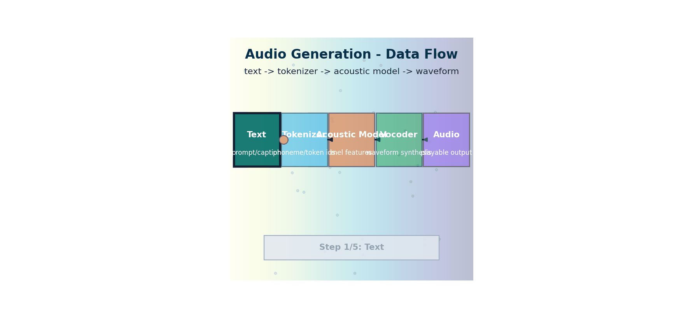

# Audio Generation - CPU Quick Win

> Build your first text-to-speech demo in minutes using a compact pretrained model that runs on a stock CPU.

*Flow: text is tokenized, transformed by an acoustic model, vocoded into a waveform, and emitted as playable audio.*

## 1. Core Idea

Audio generation is the same multimodal principle you used for image generation: transform tokens from one modality (text) into another modality (audio waveform). In this chapter, you focus on text-to-speech (TTS), where a model predicts waveform samples from text.

## 2. Running Example

PixelSmith gets a new feature: it can narrate generated captions and prompts aloud.

- Input: text prompt or image caption
- Output: playable speech waveform (`.wav`)
- Constraint: CPU-only, no GPU requirement

## 3. Notebook

Open `notebook.ipynb` for a minimal quick-win flow:

1. Install lightweight dependencies in one cell
2. Load a CPU-friendly pretrained MMS TTS model
3. Generate speech from a text string
4. Play audio inline and save to disk

## 4. Why This Is Practical

- Works on standard laptops
- Requires only a few lines of code for first output
- Easy to extend with voice styles, batching, and API serving later

## 5. Popular and Powerful Audio Models (Apr 21, 2026 snapshot)

This list is split by use-case so readers can quickly pick the right model family.

### Text-to-Speech (TTS)

| Model | Strength | Typical Runtime Profile |
|------|----------|-------------------------|
| `ElevenLabs` latest multilingual voices | Top-tier naturalness and expressiveness for production voice apps | API-first (cloud) |
| `gpt-4o-mini-tts` | Strong quality with low-latency conversational integration | API-first (cloud) |
| `Coqui XTTS v2` | Good multilingual open-source baseline with voice cloning support | GPU preferred; can run on CPU with slower inference |
| `facebook/mms-tts-*` | Lightweight and practical open multilingual TTS family | CPU-friendly |
| `hexgrad/Kokoro-82M` | Very small open TTS model, fast local experimentation | Strong CPU option |

### Speech-to-Text (ASR)

| Model | Strength | Typical Runtime Profile |
|------|----------|-------------------------|
| `Whisper large-v3` / `large-v3-turbo` | Widely used accuracy baseline across accents/noise | CPU possible; faster on GPU |
| `distil-whisper` variants | Better speed/quality trade-off for local apps | CPU-friendly for short clips |
| `NVIDIA Canary` family | Strong multilingual transcription + translation in enterprise stacks | GPU-oriented deployments |

### Music / Sound Generation

| Model | Strength | Typical Runtime Profile |
|------|----------|-------------------------|
| `Suno` latest models | Popular for prompt-to-song generation and arrangement quality | API-first (cloud) |
| `Udio` latest models | Strong melodic control and production quality | API-first (cloud) |
| `Stable Audio 2` family | Open workflow for SFX/music generation and editing | GPU preferred |
| `MusicGen` family | Good open baseline for local experimentation and research | CPU possible (slow), GPU preferred |

### What to choose for this chapter

For a true quick win on a stock CPU, start with:

1. `facebook/mms-tts-eng` (already used in the notebook)
2. `hexgrad/Kokoro-82M` (optional second local benchmark)

That keeps setup simple while still demonstrating real audio generation in action.

## 6. What To Learn Next

After this quick win, you can extend into:

- audio conditioning and style transfer
- speech-to-speech pipelines
- text-image-audio chaining in the same multimodal app
