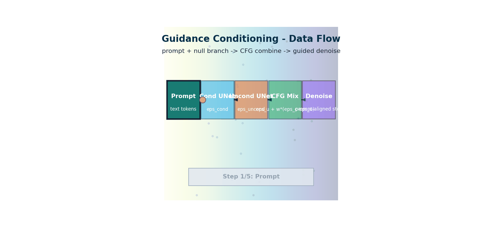

# Guidance & Conditioning — Making Diffusion Models Follow Instructions

> **The story.** A bare diffusion model produces *plausible* images — but you can't tell it what to draw. **Classifier guidance** (**Dhariwal & Nichol**, OpenAI, **May 2021**) was the first answer: train a separate classifier on noisy images and use its gradients to nudge sampling toward a chosen class. The breakthrough was **Classifier-Free Guidance (CFG)** by **Jonathan Ho and Tim Salimans** at Google in **July 2022** — train a single conditional model that occasionally ignores its condition, then at inference linearly extrapolate between conditional and unconditional predictions. Cleaner, faster, and the foundation of every modern text-to-image model. **ControlNet** (Zhang & Agrawala, Stanford, **February 2023**) added structural conditioning — edges, depth, poses, scribbles — by training a parallel "control branch" that copies and fine-tunes the U-Net's encoder. **IP-Adapter** (Tencent, 2023) added image-prompt conditioning. The diffusion-control toolbox you ship with in 2026 — negative prompts, CFG scale, ControlNet, IP-Adapter — is built on these three papers.
>
> **Where you are in the curriculum.** [LatentDiffusion](../LatentDiffusion/) wired CLIP into the U-Net so the model could *see* a text prompt. This chapter explains how it actually *follows* it: classifier-free guidance, what the guidance scale parameter does geometrically, why a CFG of 7.5 produces sharper but sometimes oversaturated images, how negative prompts work mechanically, and how ControlNet imposes structural constraints on top.



*Flow: conditional and unconditional branches are blended by CFG before each denoising update, increasing prompt adherence.*

---

## 0 · The VisualForge Studio Challenge

**Mission**: VisualForge needs <5% unusable generations to avoid wasting iteration time on regenerations.

**Current blocker at Chapter 7**: SD (Ch.6) generates from text prompts but outputs are **unpredictable**. "Product on white background" often yields cluttered backgrounds, wrong composition, weird angles. **~25% unusable** = team spends hours regenerating.

**What this chapter unlocks**: **Classifier-Free Guidance (CFG)** — guidance scale controls prompt adherence. Scale 1.0 = creative but ignores prompt. Scale 7.5 = balanced (default). Scale 12.0 = strict prompt following. **Negative prompts** subtract unwanted concepts ("blurry, cluttered, text"). Together: drops unusable rate to <15%.

---

### The 6 Constraints — Snapshot After Chapter 7

| Constraint | Target | Status | Evidence |
|------------|--------|--------|----------|
| #1 Quality | ≥4.0/5.0 | ⚡ **~3.8/5.0** | Better prompt adherence improves client ratings |
| #2 Speed | <30 seconds | ✅ **20s** | Unchanged from Ch.6 |
| #3 Cost | <$5k hardware | ✅ **$2.5k laptop** | Unchanged from Ch.6 |
| #4 Control | <5% unusable | ⚡ **<15% unusable** | CFG scale 12.0 + negative prompts improve success rate |
| #5 Throughput | 100+ images/day | ⚡ **~50 images/day** | Lower unusable rate = less regeneration time |
| #6 Versatility | 3 modalities | ⚡ **Text→Image enabled** | Still only text→image, no video/understanding |

---

### What's Still Blocking Us After This Chapter?

**Composition control**: CFG improves adherence but can't guarantee **exact composition**. "Product at 45-degree angle" still fails 60% of time. Need structural control, not just text.

**Next unlock (Ch.8)**: **ControlNet** — condition on edge maps, depth maps, pose skeletons. Designer sketches layout → ControlNet enforces structure → 95% first-try success.

---

## 1 · Core Idea

An unconditional diffusion model generates plausible images but has no mechanism for you to direct the output. **Guidance** is the technique that adds this direction. The key insight is: during denoising, instead of always moving toward "any plausible image", move toward "a plausible image **that satisfies this condition**". The condition can be a class label, a text embedding, or any other signal.

**Classifier-free guidance (CFG)** is the dominant method. Train the same U-Net for both conditional and unconditional generation (randomly dropping the condition during training). At inference, run the model twice: once with the condition and once without. Then amplify the difference: lean further in the direction of the conditioned prediction than the unconditioned prediction. The guidance scale $w$ controls how much you amplify.

---

## 2 · Running Example — PixelSmith v3.5

```
Same DDPM architecture as Ch.4, now conditioned on a digit class label (0-9)
Training: class label randomly dropped 10% of the time → model learns both
Inference: run model with label AND without → amplify the direction toward the label
Result: a 9 consistently generates nines; a 3 consistently generates threes
```

---

## 3 · The Math

### 3.1 Conditioning via Cross-Attention (text)

In text-conditioned diffusion (Stable Diffusion), the U-Net receives a sequence of text token embeddings $\mathbf{c} \in \mathbb{R}^{77 \times d}$ from the frozen CLIP text encoder. Each ResBlock in the U-Net includes a **cross-attention** layer:

$$\text{CrossAttn}(Q, K, V) = \text{softmax} \left(\frac{QK^\top}{\sqrt{d_k}}\right) V$$

where:
- $Q = W_Q \cdot \mathbf{z}$ — queries from the spatial feature map
- $K = W_K \cdot \mathbf{c}$ — keys from the text embedding
- $V = W_V \cdot \mathbf{c}$ — values from the text embedding

Each spatial location in the feature map attends to all 77 text tokens and learns which words to pay attention to for that image region.

### 3.2 Classifier Guidance (original)

The original guidance method (Dhariwal & Nichol 2021) needs a separately trained classifier $p_\phi(y | x_t)$:

$$\nabla_{x_t} \log p_\theta(x_t | y) = \nabla_{x_t} \log p_\theta(x_t) + w \cdot \nabla_{x_t} \log p_\phi(y | x_t)$$

The denoising score is shifted by the gradient of the classifier. Guidance scale $w$ amplifies this shift. **Problem:** requires training a separate noisy-image classifier at every noise level — expensive and impractical for open-domain text.

### 3.3 Classifier-Free Guidance (CFG)

Ho & Salimans (2021) eliminate the separate classifier. Train a single model $\boldsymbol{\epsilon}_\theta(x_t, t, \mathbf{c})$ with condition dropout:

$$\mathbf{c} = \emptyset \text{ (null)} \quad \text{with probability } p_{uncond} \approx 0.1$$

At inference, run the model twice:

$$\hat{\boldsymbol{\epsilon}} = \boldsymbol{\epsilon}_\theta(x_t, t, \emptyset) + w \cdot \left[ \boldsymbol{\epsilon}_\theta(x_t, t, \mathbf{c}) - \boldsymbol{\epsilon}_\theta(x_t, t, \emptyset) \right]$$

**Decomposing:**

| Term | Meaning |
|------|---------|
| $\boldsymbol{\epsilon}_\theta(x_t, t, \emptyset)$ | Unconditioned noise prediction (what any image looks like) |
| $\boldsymbol{\epsilon}_\theta(x_t, t, \mathbf{c})$ | Conditioned noise prediction (what a cat image looks like) |
| difference | The direction in noise space that moves toward the condition |
| $w \cdot \text{difference}$ | Amplify that direction by guidance scale $w$ |

**When $w = 1$:** standard conditional sampling (no extra amplification). 
**When $w = 7.5$:** the model overshoots toward the condition — images are crisper and more on-topic but may become oversaturated or lose texture diversity. 
**When $w = 0$:** unconditioned generation. Your prompt is ignored.

### 3.4 Negative Prompts

A negative prompt $\mathbf{c}_{neg}$ extends CFG:

$$\hat{\boldsymbol{\epsilon}} = \boldsymbol{\epsilon}_\theta(x_t, t, \mathbf{c}_{neg}) + w \cdot \left[ \boldsymbol{\epsilon}_\theta(x_t, t, \mathbf{c}) - \boldsymbol{\epsilon}_\theta(x_t, t, \mathbf{c}_{neg}) \right]$$

The model moves away from $\mathbf{c}_{neg}$ and toward $\mathbf{c}$. Common negative prompts include "blurry, low quality, watermark" — the model actively steers away from those image features.

---

## 4 · How It Works — Step by Step

**Class-conditional training:**
1. Assign each training image a class label (e.g., digit 0–9)
2. Embed the class label as a vector $\mathbf{c}$ (learnable lookup table)
3. Add $\mathbf{c}$ to the timestep embedding and inject into every ResBlock
4. With probability $p = 0.1$, replace $\mathbf{c}$ with a null embedding $\emptyset$
5. Train with the same MSE noise prediction loss

**Class-conditional inference:**
1. Start from $x_T \sim \mathcal{N}(0, \mathbf{I})$
2. At each step $t$:
 - Compute $\boldsymbol{\epsilon}_{cond} = \boldsymbol{\epsilon}_\theta(x_t, t, \mathbf{c})$ (one forward pass)
 - Compute $\boldsymbol{\epsilon}_{uncond} = \boldsymbol{\epsilon}_\theta(x_t, t, \emptyset)$ (second forward pass)
 - CFG: $\hat{\boldsymbol{\epsilon}} = \boldsymbol{\epsilon}_{uncond} + w \cdot (\boldsymbol{\epsilon}_{cond} - \boldsymbol{\epsilon}_{uncond})$
 - Sample $x_{t-1}$ using $\hat{\boldsymbol{\epsilon}}$

**Note:** CFG doubles the compute cost at inference (two U-Net calls per step). Distilled models like LCM/Turbo can do CFG in a single pass.

---

## 5 · The Key Diagrams

### CFG Geometry in Noise Space

```
Unconditioned score direction: "move toward any plausible image"
 ε_uncond ────────────▶

Conditioned score direction: "move toward an image of a cat"
 ε_cond ────────────────────▶

CFG direction (w=7.5): "move MUCH more strongly toward cat"
 ε_cfg ────────────────────────────────────────────▶

 = ε_uncond + 7.5 × (ε_cond - ε_uncond)

Effect: at the cost of diversity, the image will be much more obviously a cat.
```

### Cross-Attention in the U-Net

```
Feature map (spatial) Text tokens
(B, d, H, W) (B, 77, d_text)
 │ │
 ▼ Linear W_Q ▼ Linear W_K, W_V
 Q (B, H*W, d_k) K (B, 77, d_k)
 │ V (B, 77, d_v)
 └─────────────────────────┐
 ▼
 softmax(Q·Kᵀ / √d_k) · V
 │
 ▼
 (B, H*W, d_v)
 
Each image region (row in Q) learns which text tokens to attend to.
"fluffy" → attends to fur-like spatial regions.
"blue sky" → attends to the top of the image.
```

---

## 6 · What Changes at Scale

| Parameter | Effect | Typical values |
|-----------|--------|---------------|
| Guidance scale $w$ | Higher = more faithful to prompt, less diversity | 5–15 (SD default: 7.5) |
| $p_{uncond}$ (dropout rate) | Higher = stronger unconditional capability | 0.05–0.2 |
| Text encoder frozen? | Fine-tuning CLIP with diffusion can hurt CLIP's zero-shot | Always frozen in SD |
| Cross-attention resolution | More attention layers → better text following | SD adds at 8×8, 16×16, 32×32, 64×64 |

**Perp-Neg (2023):** An extension of CFG that uses multiple negative prompts and handles the perpendicular direction in embedding space — prevents unintended semantic bleed between prompt elements.

---

## 7 · Common Misconceptions

**"Higher guidance scale = always better"**
High guidance scales (>15) cause **oversaturation**: vivid, unnatural colours and textures. The optimal range depends on the model and the prompt. Most production pipelines use 5–12.

**"Negative prompts remove objects from the image"**
Negative prompts steer the model away from a semantic direction — they cannot target specific spatial regions. "no cat" as a negative prompt reduces overall cat-like features but cannot guarantee they are absent. ControlNet (Ch.8) provides structural control.

**"CFG is free because the second pass is cheap"**
The second U-Net forward pass is identical in cost to the first. CFG strictly doubles inference compute. This is why reducing sampling steps (Ch.6) is critical for practical deployment.

**"The null embedding ∅ means 'all zeros'"**
In most implementations, the null embedding is the encoded representation of an empty string (`""`), not literally a zero vector. Some implementations use a learnable null token.

---

## 8 · Interview Checklist

### Must Know
- Write the CFG equation. What are the two model calls?
- What does guidance scale $w = 1$ vs $w = 7.5$ vs $w = 15$ produce?
- How is condition dropout used during CFG training?

### Likely Asked
- "How does a negative prompt work mechanically?"
 → Replace the unconditioned embedding with the negative prompt embedding; the CFG equation then steers the image away from the negative and toward the positive
- "Why is CFG inference twice as slow as unconditioned inference?"
 → Two separate U-Net forward passes per denoising step — one conditioned, one not
- "What is attention control / prompt-to-prompt?"
 → Manipulate the cross-attention maps directly (instead of changing the embedding) to achieve localised edits: change "a photo of a cat" to "a photo of a dog" while keeping the composition

### Trap to Avoid
- Confusing guidance scale with classifier temperature — they are different mechanisms
- Saying negative prompts "block" content — they steer, not filter
- Forgetting that $w=0$ ignores the prompt entirely (unconditioned), not $w=1$

---

## 8.5 · Progress Check — What Have We Unlocked?

### Before This Chapter
- **Constraint #1 (Quality)**: ⚡ ~3.5/5.0, text prompts work but outputs unpredictable
- **Constraint #4 (Control)**: ⚡ ~25% unusable (wrong composition, cluttered backgrounds)
- **VisualForge Status**: Team spends hours regenerating to get usable outputs

### After This Chapter
- **Constraint #1 (Quality)**: ⚡ **3.8/5.0** → CFG improves prompt adherence
- **Constraint #4 (Control)**: ⚡ **<15% unusable** → CFG scale 12.0 + negative prompts improve success rate
- **Constraint #5 (Throughput)**: ⚡ **~50 images/day** → Lower unusable rate = less wasted regeneration time
- **VisualForge Status**: Prompt "modern office with natural light" + negative "cluttered, dark" → 85% success rate

---

### Key Wins

1. **CFG scale control**: Guidance 7.5 = balanced, 12.0 = strict prompt following → tunable adherence
2. **Negative prompts**: "blurry, low quality, watermark, cluttered" subtracts unwanted concepts
3. **Cross-attention mechanism**: Understand how text tokens reach U-Net spatial layers (each pixel attends to 77 text tokens)

---

### What's Still Blocking Production?

**Composition/pose control**: CFG improves adherence but can't guarantee **exact layout**. "Product at 45-degree angle" still fails 60% of time. Text alone isn't precise enough for spatial constraints — need **structural conditioning**.

**Next unlock (Ch.8)**: **Text-to-Image (ControlNet)** — condition on edge maps, depth maps, pose skeletons. Designer sketches rough layout → ControlNet enforces structure → 95% first-try success rate.

---

## 9 · What's Next

→ **[Schedulers.md](../Schedulers/Schedulers.md)** — CFG doubles inference compute. With 1000 DDPM steps and 2 U-Net calls per step, generating one image requires 2000 forward passes. DDIM and DPM-Solver reduce this to 20–50 steps without retraining, cutting generation time from minutes to seconds. Understanding how they achieve this requires understanding the geometry of the diffusion trajectory.

## Illustrations


