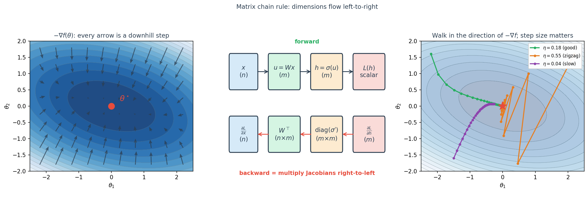

# Ch.6 — Gradient + Matrix Chain Rule

> **Running theme.** Our free-throw coach has gone from tuning one knob (angle) to tuning eight (speed, angle, height, wind, spin, altitude, fatigue, defender-distance). In a scalar world the derivative told us which way was downhill. Now we need a *vector* that points downhill in 8-D — the **gradient** — and a rule for composing many such vectors through deep layers — the **matrix chain rule**. Backpropagation is those two ideas braided together.

---

## 1 · Core Idea

For a scalar-input, scalar-output function we have $f'(\theta)$. For a **vector-input, scalar-output** function $f : \mathbb{R}^d \to \mathbb{R}$, the same role is played by the **gradient**:

$$\nabla f(\boldsymbol{\theta}) \;=\; \begin{bmatrix}\dfrac{\partial f}{\partial \theta_1} \\ \vdots \\ \dfrac{\partial f}{\partial \theta_d}\end{bmatrix} \in \mathbb{R}^d.$$

Three facts you must internalise:

1. $\nabla f$ points in the direction of **steepest ascent**; $-\nabla f$ is the direction of steepest descent.
2. The magnitude $\|\nabla f\|$ is the *slope* in that direction.
3. At a minimum, $\nabla f = \mathbf{0}$ (first-order optimality condition).

Gradient descent is just Ch.4 with $f'(\theta)$ replaced by $\nabla f(\boldsymbol{\theta})$:

$$\boldsymbol{\theta}_{k+1} \;=\; \boldsymbol{\theta}_k \;-\; \eta\,\nabla f(\boldsymbol{\theta}_k).$$

---

## 2 · Why Steepest Descent Is $-\nabla f$

A first-order Taylor expansion around $\boldsymbol{\theta}$ in a direction $\mathbf{u}$ with $\|\mathbf{u}\|=1$ and step $t > 0$:

$$f(\boldsymbol{\theta} + t\mathbf{u}) \;\approx\; f(\boldsymbol{\theta}) + t\,\mathbf{u}^\top \nabla f(\boldsymbol{\theta}).$$

The inner product $\mathbf{u}^\top \nabla f$ is minimised (most negative) when $\mathbf{u} = -\nabla f / \|\nabla f\|$ by the Cauchy–Schwarz inequality. So among all unit directions, *"against the gradient"* drops the function the fastest.

---

## 3 · Jacobian — the Gradient's Big Sibling

For a **vector-input, vector-output** function $\mathbf{g} : \mathbb{R}^n \to \mathbb{R}^m$, the derivative is a matrix — the **Jacobian** $J_\mathbf{g} \in \mathbb{R}^{m \times n}$ — with entries $[J_\mathbf{g}]_{ij} = \partial g_i / \partial x_j$:

| Function shape | Derivative object | Shape |
|---|---|---|
| $f : \mathbb{R} \to \mathbb{R}$ | scalar $f'(x)$ | $1 \times 1$ |
| $f : \mathbb{R}^n \to \mathbb{R}$ | gradient $\nabla f$ | $n \times 1$ |
| $\mathbf{g} : \mathbb{R}^n \to \mathbb{R}^m$ | Jacobian $J_\mathbf{g}$ | $m \times n$ |
| $f : \mathbb{R}^n \to \mathbb{R}$, 2nd-order | Hessian $\nabla^2 f$ | $n \times n$ |

The gradient is the special case of a Jacobian when $m=1$, transposed into a column vector. That's all.

---

## 4 · The Matrix Chain Rule

This is the single most important equation in deep learning. For a composition $\mathbf{y} = \mathbf{g}(\mathbf{h}(\mathbf{x}))$ with $\mathbf{x} \in \mathbb{R}^n, \mathbf{h} \in \mathbb{R}^p, \mathbf{y} \in \mathbb{R}^m$:

$$J_{\mathbf{g}\circ \mathbf{h}}(\mathbf{x}) \;=\; J_\mathbf{g}(\mathbf{h}(\mathbf{x})) \; J_\mathbf{h}(\mathbf{x})$$

$$(m \times n) \;=\; (m \times p) \;\cdot\; (p \times n)$$

Compare to the scalar chain rule $[f(g(x))]' = f'(g(x)) \cdot g'(x)$ — same thing, but the product is now matrix multiplication and the dimensions must fit end-to-end.

**Special case — scalar loss.** If the outer function is a scalar loss $L : \mathbb{R}^m \to \mathbb{R}$, we usually care about $\nabla_\mathbf{x} L$. Setting $m = 1$ and transposing:

$$\nabla_\mathbf{x} L \;=\; J_\mathbf{h}(\mathbf{x})^\top \,\nabla_\mathbf{h} L$$

The $(n \times p)$ matrix $J_\mathbf{h}^\top$ pulls the $p$-dim gradient of the loss back into the $n$-dim input space. That right-to-left multiplication is the **backward pass**.

---

## 5 · Worked Example — One Neural-Network Layer

A single layer: $\mathbf{u} = W\mathbf{x} + \mathbf{b}$, then $\mathbf{h} = \sigma(\mathbf{u})$ applied elementwise, then a scalar loss $L(\mathbf{h})$.

**Forward pass** (shapes): $\mathbf{x}\,(n) \xrightarrow{W\,(m\times n)} \mathbf{u}\,(m) \xrightarrow{\sigma} \mathbf{h}\,(m) \xrightarrow{L} \text{scalar}.$

**Backward pass** — apply the chain rule right-to-left:

$$\underbrace{\nabla_\mathbf{h} L}_{m} \; \xrightarrow[\text{mul by } J_\sigma]{} \; \underbrace{\nabla_\mathbf{u} L \;=\; \nabla_\mathbf{h} L \odot \sigma'(\mathbf{u})}_{m} \; \xrightarrow[\text{mul by } W^\top]{} \; \underbrace{\nabla_\mathbf{x} L \;=\; W^\top (\nabla_\mathbf{h} L \odot \sigma'(\mathbf{u}))}_{n}$$

(The Jacobian of an elementwise $\sigma$ is the diagonal matrix $\mathrm{diag}(\sigma'(\mathbf{u}))$, so multiplying by it collapses to elementwise product $\odot$ — a free speed-up.)

For the weight gradient, another one-line chain rule:

$$\nabla_W L \;=\; (\nabla_\mathbf{u} L)\,\mathbf{x}^\top \qquad (m \times n).$$

Stack $L$ layers and you have backprop.

---

## 6 · Reverse-Mode vs Forward-Mode Autodiff

For a composition $\mathbf{y} = \mathbf{f}_L \circ \cdots \circ \mathbf{f}_1(\mathbf{x})$, the matrix chain rule gives $J = J_L J_{L-1} \cdots J_1$. Matrix multiplication is associative, so we can multiply in any order — but the **cost** of multiplying in different orders can differ by orders of magnitude.

- **Forward mode** — multiply left-to-right: $((J_L J_{L-1}) J_{L-2}) \cdots J_1$. Efficient when the *input* dimension is small (one scalar input, many outputs).
- **Reverse mode** — multiply right-to-left *starting from a scalar output*: $J_1^\top (J_2^\top (\cdots J_L^\top \nabla_\mathbf{y} L))$. Efficient when the *output* dimension is small (many parameters, one scalar loss — *exactly* the deep-learning setting).

Reverse-mode autodiff = backpropagation. You never form any Jacobian explicitly; you just carry a running gradient vector and multiply it by $J_\ell^\top$ at each layer on the way back.

---

## 7 · Hessian & Curvature — Ch.4 Revisited in Vector Form

The Hessian $H = \nabla^2 f \in \mathbb{R}^{d\times d}$ has entries $H_{ij} = \partial^2 f / \partial \theta_i \partial \theta_j$. Near a minimum:

- If $H \succ 0$ (positive definite, all eigenvalues positive): strict local minimum.
- The eigenvalues $\lambda_1 \le \cdots \le \lambda_d$ give the curvature along principal axes. The condition number $\kappa = \lambda_d / \lambda_1$ controls how "narrow" the valley is.
- Gradient descent converges at rate $\rho = (\kappa - 1)/(\kappa + 1)$ with optimal step size $\eta = 2/(\lambda_1 + \lambda_d)$.

The middle panel of the hero image uses a Hessian with eigenvalues $\{0.7, 3.3\}$, so $\kappa \approx 4.7$. That's why large steps zigzag across the short axis.

---

## 8 · Pitfalls

1. **Shape mismatches.** Always track $(n), (m), (m\times n)$ annotations on paper. Most "math bugs" in deep-learning code are transposed Jacobians.
2. **Forgetting the transpose in the backward pass.** The forward map multiplies by $W$; the backward map multiplies by $W^\top$. Not $W^{-1}$, not $W$.
3. **Treating $\odot$ and matrix multiplication interchangeably.** For diagonal Jacobians (elementwise activations) they look the same numerically but have different shapes — be explicit.
4. **Numerical gradient check against analytic formula every time.** `(L(θ + ε e_j) − L(θ − ε e_j)) / (2ε)` should match $\partial L / \partial \theta_j$ to ~6 digits.
5. **Exploding/vanishing gradients in deep stacks.** If each $\|W_\ell^\top \mathrm{diag}(\sigma'_\ell)\|$ is $> 1$ on average, the backward product explodes; if $< 1$, it vanishes. This is the entire reason ResNets, LayerNorm, and gating exist.
6. **Saddle points.** $\nabla f = 0$ does not mean a minimum. Look at Hessian eigenvalues — if they're mixed sign, you're at a saddle, not a valley floor.

---

## 9 · Where This Reappears

- **ML Ch.5 Backprop & Optimisers.** The layer-by-layer derivation above, scaled up to arbitrary architectures.
- **ML Ch.4 Neural Networks.** Every training step is forward + backward = two tours of the computation graph.
- **ML Ch.7 CNNs** and **Ch.18 Transformers.** Same chain rule; convolutions and attention blocks are just specific Jacobians.
- **RL policy gradients.** $\nabla_\theta \mathbb{E}[R]$ is chain rule through a stochastic computation graph.
- **Ch.7 (next).** We'll need expectations and variances to define probabilistic losses whose gradients we then differentiate with the very rules above.

---

## 10 · References

- Nocedal & Wright, *Numerical Optimization*, Ch. 2.
- Magnus & Neudecker, *Matrix Differential Calculus with Applications in Statistics and Econometrics* — the definitive shape-centric treatment.
- Baydin et al., *Automatic Differentiation in Machine Learning: a Survey* (JMLR 2018).
- 3Blue1Brown, *Neural networks* series — the backprop video is a masterclass.
- Goodfellow, Bengio & Courville, *Deep Learning* Ch. 6.5 (back-propagation).
