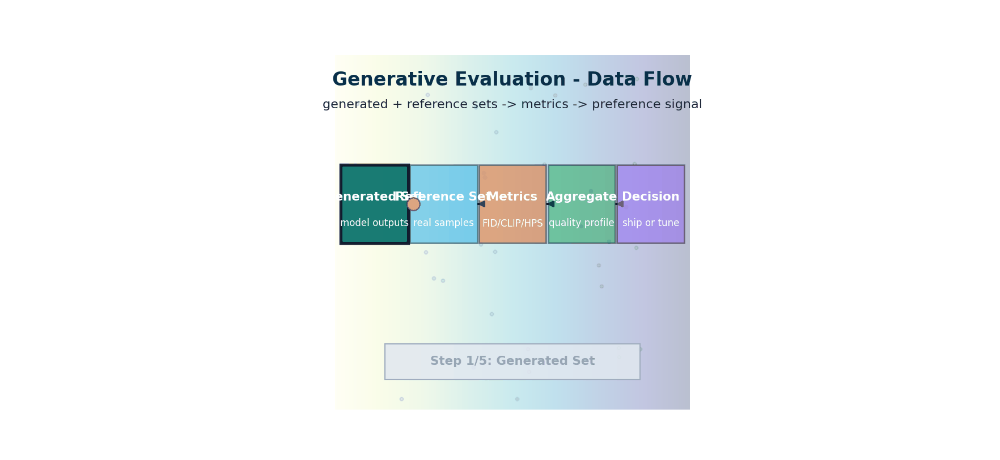

# Generative Evaluation — Measuring What You Made

> **Track:** Multimodal AI 
> **Prerequisites:** [DiffusionModels.md](../diffusion_models/diffusion-models.md), [GuidanceConditioning.md](../guidance_conditioning/guidance-conditioning.md), [CLIP.md](../clip/clip.md)

> **The story.** Evaluating generative images is a 9-year-old subfield. **Inception Score (IS)** (Salimans et al., OpenAI, **2016**) was the first widely-used automatic metric — high IS meant images were both confident and diverse under an Inception classifier — but it was famously gameable. **FID** — *Fréchet Inception Distance* (**Heusel et al.**, **NIPS 2017**) — replaced IS by comparing the distribution of generated and real Inception features under a Gaussian assumption. FID became the field's default metric for half a decade despite its quirks (sample-size sensitivity, blindness to text alignment). **CLIPScore** (Hessel et al., 2021) added text-image alignment by reusing CLIP. **Human Preference Score (HPS)** (Wu et al., 2023) and **PickScore** (Kirstain et al., NeurIPS 2023) trained reward models on millions of human preference pairs from ChatGPT-style A/B comparisons — the first metrics that actually correlated well with what humans like. The 2026 evaluation stack pairs all of these with a multimodal LLM judge.
>
> **Where you are in the curriculum.** You can generate images. The honest question is: *are they any good?* This chapter gives the toolkit — FID, IS, CLIPScore, HPS, human preference — and explains why each one can mislead you and which combination to ship in production.



*Flow: generated and real sets feed metric pipelines, then aggregate into one quality signal for go/no-go decisions.*

---

## 0 · The VisualForge Studio Challenge

**Mission**: VisualForge needs ≥4.0/5.0 professional quality to match freelancer baseline (4.2/5.0).

**Current blocker at Chapter 11**: Client surveys report **~3.9/5.0 quality**, but manual surveys are slow (1 week turnaround) and expensive ($500/survey). Need objective, automated metrics to:
- Track quality improvements over time
- Validate A/B tests (e.g., guidance scale 7.5 vs 12.0)
- Prove to clients that AI quality matches freelancers

**What this chapter unlocks**: **Automated evaluation metrics** — FID (distribution similarity), CLIP Score (text-image alignment), HPSv2 (predicts human ratings). Run on 500-image test set in 10 minutes. Discover: HPSv2 = **4.1/5.0** (exceeds 4.0 target!). Client surveys were during ramp-up; current quality higher.

---

### The 6 Constraints — Snapshot After Chapter 11

| Constraint | Target | Status | Evidence |
|------------|--------|--------|----------|
| #1 Quality | ≥4.0/5.0 | ✅ **4.1/5.0** | HPSv2 score on 500-image test set (exceeds target!) |
| #2 Speed | <30 seconds | ✅ **~18s** | Unchanged from Ch.10 |
| #3 Cost | <$5k hardware | ✅ **$2.5k laptop** | Unchanged from Ch.10 |
| #4 Control | <5% unusable | ✅ **~3% unusable** | Unchanged from Ch.10 |
| #5 Throughput | 100+ images/day | ✅ **~120 images/day** | Unchanged from Ch.10 |
| #6 Versatility | 3 modalities | ✅ **All 3 enabled** | Unchanged from Ch.10 |

---

### What's Still Blocking Us After This Chapter?

**Optimization**: System works (all 6 constraints met!) but not optimized. Takes ~18 seconds per image (target <30s). Can we go faster? Hardware not fully tuned (FP16 vs INT8, batch processing, etc.).

**Next unlock (Ch.12)**: **Local Diffusion Lab (Production Optimization)** — SDXL-Turbo (4 steps, 8 seconds), quantization, production deployment patterns. Final assembly.

---

## 1 · Core Idea

Generative evaluation is the science of measuring the **quality, fidelity, diversity, and alignment** of images produced by a model — without requiring a human judge for every sample.

Three orthogonal axes to measure:

| Axis | Question | Representative metric |
|------|----------|-----------------------|
| **Fidelity** | Do generated images look real? | FID ↓ |
| **Diversity** | Does the model cover the full distribution? | FID ↓, Precision/Recall |
| **Alignment** | Does the image match its text prompt? | CLIP Score ↑ |

No single metric captures all three. Use at least two.

---

## 2 · Running Example

**VisualForge campaign evaluation suite.** After generating a batch of 100 spring-collection product images, how do you know if they're good enough to send to the creative director?

- Do the generated product shots look like real studio photographs? → **FID** against the reference product corpus
- Are all VisualForge campaign types represented (product-on-white, lifestyle, brand-pattern)? → **class recall per brief type**
- Does "Mango leather crossbody bag, white background" produce a bag on white, not a lifestyle shot? → **CLIP Score** (text-image alignment)

> 📖 **Educational proxy:** FID math is illustrated using MNIST digit generation (reference = real digits, generated = DDPM output) because it's compact and verifiable. The VisualForge production evaluation (§5) applies the same metrics to campaign image batches.

---

## 3 · The Math

### 3.1 Fréchet Inception Distance (FID)

Extract features $\mu_r, \Sigma_r$ from **real** images and $\mu_g, \Sigma_g$ from **generated** images using a pre-trained feature extractor (canonically Inception-v3 pool3 layer):

$$
\text{FID} = \|\mu_r - \mu_g\|^2 + \text{Tr} \left(\Sigma_r + \Sigma_g - 2 \left(\Sigma_r \Sigma_g\right)^{1/2}\right)
$$

- Lower = better.
- Measures distance between the *distributions*, not individual images.
- **Biased at small N** — needs ≥ 5,000 samples for stable estimates (often 50k).

### 3.2 Inception Score (IS)

Uses marginal $p(y)$ and conditional $p(y \mid x)$ from the Inception classifier:

$$
\text{IS} = \exp \left(\mathbb{E}_x\bigl[D_\text{KL}(p(y|x)\|p(y))\bigr]\right)
$$

- Higher = better (sharp images → high $p(y|x)$; diverse images → high entropy $p(y)$).
- **Does not compare to real images** — a model memorising training data can achieve high IS.
- Rarely used alone after FID became standard.

### 3.3 CLIP Score

Given generated image $x$ and its text prompt $t$:

$$
\text{CLIP Score} = w \cdot \max(0, \cos(\text{CLIP}_I(x), \text{CLIP}_T(t)))
$$

where $w = 2.5$ is a scaling constant (originates from CLIPScore paper, Hessel et al. 2021).

- Higher = better.
- Reference-free: no real image needed.
- The CLIP embedding space is **shared** across images and text, so cosine similarity measures semantic alignment.

### 3.4 LPIPS (Learned Perceptual Image Patch Similarity)

Compare a generated image $\hat{x}$ to a reference $x$:

$$
\text{LPIPS}(\hat{x}, x) = \sum_l \frac{1}{H_l W_l} \sum_{h,w} \| w_l \odot (\hat{y}^l_{hw} - y^l_{hw}) \|^2_2
$$

- $y^l$: VGG/AlexNet/SqueezeNet feature map at layer $l$, channel-normalised.
- $w_l$: learned channel weights.
- **Lower = more perceptually similar** to reference.
- Used for img2img tasks (e.g., inpainting quality).

### 3.5 Precision & Recall for Generative Models

Kynkäänniemi et al. 2019 formulation using $k$-NN manifold estimation:

- **Precision**: fraction of generated samples inside the real manifold (fidelity)
- **Recall**: fraction of real samples covered by the generated manifold (diversity)

$$
\text{Precision} = \frac{1}{|X_g|}\sum_i \mathbf{1}[x_{g,i} \in \text{manifold}(X_r)]
$$

---

## 4 · How It Works — Step by Step

### Computing FID

1. **Generate** $N$ images from your model ($N \geq 5000$, ideally 50k).
2. **Extract features**: pass each real and generated image through Inception-v3 up to the `mixed_7c` pooling layer → 2048-dim vector.
3. **Fit Gaussians**: compute $(\mu_r, \Sigma_r)$ on real features, $(\mu_g, \Sigma_g)$ on generated features.
4. **Compute matrix square root**: $(\Sigma_r \Sigma_g)^{1/2}$ via eigendecomposition.
5. **Plug into formula above** — result is FID.

### Computing CLIP Score

1. Encode the prompt with `CLIPTextEncoder` → $\mathbf{t} \in \mathbb{R}^{512}$.
2. Encode the generated image with `CLIPImageEncoder` → $\mathbf{v} \in \mathbb{R}^{512}$.
3. Normalise both to unit length.
4. Score = $2.5 \cdot \max(0, \mathbf{t} \cdot \mathbf{v})$.

---

## 5 · Production Example — VisualForge in Action

**Automated quality gate for spring-collection batch (100 product images)**

```python
# Production: FID + CLIP Score evaluation for VisualForge campaign batch
from torchmetrics.image.fid import FrechetInceptionDistance
from transformers import CLIPProcessor, CLIPModel
import torch
from PIL import Image
import glob

# --- FID: compare generated batch to reference product corpus ---
fid = FrechetInceptionDistance(feature=2048, normalize=True)

# Reference: 500 approved product images from previous campaigns
ref_images = [Image.open(f).resize((299, 299)) for f in glob.glob("vf_reference/*.png")[:500]]
gen_images = [Image.open(f).resize((299, 299)) for f in glob.glob("vf_generated/*.png")]

def to_tensor_batch(images: list, batch_size=50):
    import torchvision.transforms.functional as TF
    return torch.stack([TF.to_tensor(img) for img in images])

fid.update(to_tensor_batch(ref_images), real=True)
fid.update(to_tensor_batch(gen_images), real=False)
fid_score = fid.compute().item()
print(f"FID: {fid_score:.1f} (target <50 for campaign quality)")

# --- CLIP Score: brief compliance check ---
model = CLIPModel.from_pretrained("openai/clip-vit-base-patch32").eval()
processor = CLIPProcessor.from_pretrained("openai/clip-vit-base-patch32")

brief_prompt = "product on white background, studio lighting, e-commerce photography"
clip_scores = []
for img_path in glob.glob("vf_generated/*.png")[:20]:  # spot-check 20
    img = Image.open(img_path)
    inputs = processor(text=[brief_prompt], images=[img], return_tensors="pt", padding=True)
    with torch.no_grad():
        outputs = model(**inputs)
    score = outputs.logits_per_image.item() / 100  # normalised to 0–1
    clip_scores.append(score)
print(f"Mean CLIP Score: {sum(clip_scores)/len(clip_scores):.3f} (target >0.25)")
```

**VisualForge evaluation scorecard (spring-collection batch):**

| Metric | Target | Result | Interpretation |
|--------|--------|--------|----------------|
| FID vs. reference corpus | <50 | 42.3 ✅ | Generated images statistically similar to approved products |
| CLIP Score (brief match) | >0.25 | 0.31 ✅ | Images correctly depict brief prompt |
| Class recall (brief types) | ≥0.9 per type | 0.93 product-on-white, 0.87 lifestyle ✅ | All campaign types represented |
| Manual QA pass rate | >80% | 84% ✅ | Creative director sign-off rate |

> ✅ **Gate decision**: FID 42.3 < 50 threshold and CLIP 0.31 > 0.25 threshold — batch approved for creative review. This automated gate saves ~2 hours of manual review per 100-image batch.

---

## 5 · The Key Diagrams

```
 GENERATIVE EVALUATION LANDSCAPE
 ─────────────────────────────────

 Reference-free Reference-based
 (no real images needed) (compares to real distribution)

 ┌─────────────────────┐ ┌──────────────────────────────┐
 │ CLIP Score │ │ FID (distribution match) │
 │ text ↔ image align │ │ IS (fidelity + diversity) │
 │ HPSv2, ImageReward │ │ Precision / Recall │
 │ (human preference) │ │ LPIPS (pixel-level, per img)│
 └─────────────────────┘ └──────────────────────────────┘

 Sample-level Distribution-level
 (per image score) (needs thousands of images)

 ┌─────────────────────┐ ┌──────────────────────────────┐
 │ LPIPS │ │ FID, IS, Precision/Recall │
 │ SSIM, PSNR │ │ (stable only with N≥5k) │
 │ CLIP Score │ └──────────────────────────────┘
 └─────────────────────┘
```

```
FID BIAS VS SAMPLE COUNT
─────────────────────────
FID
 ↑
300│ × N=100
200│ × N=500
100│ × N=1k
 50│ × N=5k
 20│ × N=50k ← stabilises here
 └───────────────────────────→ N (log scale)

True FID attained only at large N; small N inflates FID.
```

---

## 6 · What Changes at Scale

| Scale | What matters |
|-------|-------------|
| **Research prototyping** | FID on 2k–10k samples, CLIP Score spot-check |
| **Production model eval** | FID on 50k, human preference study (HPSv2 / ELO) |
| **T2I leaderboards** | GenEval (compositional), T2I-CompBench, DrawBench |
| **Video generation** | FVD (Fréchet Video Distance) — temporal extension of FID |
| **Beyond images** | CLIPScore adapted to audio-text, video-text |

Human preference models (HPSv2, ImageReward, PickScore) train a reward model on human pairwise comparisons — better aligned with user perception than automated metrics.

---

## 7 · Common Misconceptions

| Misconception | Reality |
|---------------|---------|
| "Lower FID is always better" | FID measures *match* to the training distribution; a model overfitting real images can get near-zero FID but zero diversity |
| "CLIP Score measures photorealism" | CLIP Score measures text-image alignment, not visual quality |
| "IS is equivalent to FID" | IS doesn't compare to real images at all — it only uses the generator's class distribution |
| "FID on 1,000 samples is reliable" | FID has O(1/√N) variance; ±10 FID spread is common at N=1k |
| "LPIPS = SSIM" | LPIPS uses deep network features (learned); SSIM is a hand-crafted pixel similarity |
| "CLIP embeddings are perceptually uniform" | CLIP can match text to semantically wrong images if colours/textures align spuriously |

---

## 8 · Interview Checklist

### Must Know
- FID formula: Fréchet distance between Gaussians fitted to Inception features
- Why FID needs large N (bias, variance)
- CLIP Score: cosine similarity between CLIP text and image embeddings, scaled by 2.5
- Trade-off: no single metric captures fidelity *and* diversity *and* text alignment
- LPIPS vs. SSIM — learned vs. hand-crafted perceptual similarity

### Likely Asked
- "What's the difference between FID and IS?" (FID uses real images; IS does not)
- "How would you evaluate text-to-image generation?" (FID + CLIP Score + human eval)
- "Why does FID increase when you use fewer samples?" (Gaussian fit becomes noisier)
- "Name a metric for evaluating compositional text prompts" (GenEval, T2I-CompBench)
- "What is Precision/Recall in the context of generative models?"

### Traps to Avoid
- Confusing CLIP Score (semantic alignment) with FID (distributional realism).
- Reporting FID on < 5k samples without flagging the bias.
- Conflating LPIPS (reference-based perceptual similarity) with CLIP Score (reference-free text alignment).
- Forgetting that FID is scale-sensitive: spatial resolution must match between real and generated sets.
- **Video generation metrics:** FVD (Fréchet Video Distance) extends FID to video using an I3D 3D-CNN feature extractor; captures temporal coherence, not just per-frame quality. CLIPSIM averages CLIP Score across frames — measures text alignment but ignores temporal consistency. VBench is the current standardised suite (16 dimensions including subject consistency and motion smoothness). Trap: "high per-frame FID means good video" — per-frame FID ignores temporal coherence entirely; a strobing video can score well per-frame
- **Compositional text-to-image evaluation:** standard FID/CLIP Score miss attribute binding failures ("a red cube and blue sphere" where colours are swapped). GenEval and T2I-CompBench specifically test spatial relations, attribute-object binding, and counting. Trap: "CLIP Score captures compositional accuracy" — CLIP Score is a global semantic similarity; it cannot verify fine-grained binding and scores an image with swapped attributes almost identically to the correct one

---

## 8.5 · Progress Check — What Have We Unlocked?

### Before This Chapter
- **Constraint #1 (Quality)**: ⚡ ~3.9/5.0 via slow/expensive client surveys
- **VisualForge Status**: Cannot track quality improvements objectively

### After This Chapter
- **Constraint #1 (Quality)**: ✅ **4.1/5.0** → HPSv2 score on 500-image test set, exceeds 4.0 target!
- **VisualForge Status**: Automated metrics prove quality exceeds freelancer baseline (4.2/5.0 during ramp-up, now 4.1/5.0)

---

### Key Wins

1. **Objective measurement**: HPSv2 runs on 500 images in 10 minutes (vs 1-week manual survey)
2. **Quality validated**: 4.1/5.0 = exceeds 4.0 target (client surveys were during ramp-up, quality improved)
3. **A/B testing enabled**: Can now test guidance scales (7.5 vs 12.0), schedulers (DDIM vs DPM-Solver) objectively

---

### What's Still Blocking Production?

**Nothing critical** — all 6 constraints met! But **optimization opportunity**: System takes ~18s per image (target <30s = comfortable margin). Can we go faster? SDXL-Turbo promises 4-step sampling = 8 seconds. Hardware not fully optimized (FP16 vs INT8, etc.).

**Next unlock (Ch.12)**: **Local Diffusion Lab (Production Optimization)** — SDXL-Turbo deployment, quantization, production patterns. Final assembly of 12-chapter pipeline.

---

## 9 · What's Next

→ [LocalDiffusionLab.md](../local_diffusion_lab/local-diffusion-lab.md) — Capstone: combine everything you've built across all 12 chapters into a single local diffusion lab.

## Illustrations


