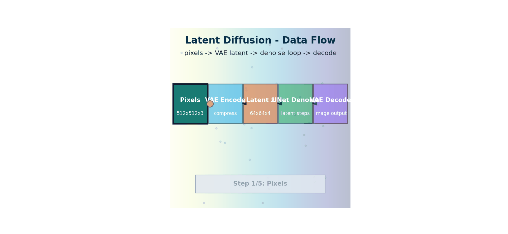

# Latent Diffusion — Compress, Diffuse, Decode

> **The story.** Pixel-space DDPM works but is brutally expensive: every denoising step touches all 262 144 dimensions of a 512×512 RGB image, and you need hundreds of steps. In **December 2021** **Robin Rombach** and **Andreas Blattmann** at LMU Munich published *"High-Resolution Image Synthesis with Latent Diffusion Models"* — their fix was to first compress the image into a smaller latent space with a **VAE** (Kingma & Welling, **2013**), diffuse there (16× cheaper per step), then decode back to pixels. Stability AI productised the resulting model as **Stable Diffusion 1.4** in **August 2022** under an open licence — and the open-source generative-AI ecosystem (ComfyUI, Automatic1111, LoRAs, ControlNet, every Civitai model) exploded into existence within months. Latent diffusion is the architecture every modern open image generator uses (SDXL, SD3, FLUX), and the architectural template behind video diffusion ([TextToVideo](../text_to_video)) and audio diffusion (AudioLDM, Stable Audio).
>
> **Where you are in the curriculum.** [DiffusionModels](../diffusion_models) gave you DDPM in pixel space. This chapter assembles the three components — [CLIP](../clip) text encoder + VAE + diffusion U-Net — into Stable Diffusion. After this, the rest of the track is configuration and conditioning on top of this same skeleton.



*Flow: pixels are compressed into a latent grid, denoised there for efficiency, then decoded back to full-resolution imagery.*

---

## 0 · The VisualForge Studio Challenge

**Mission**: VisualForge Studio needs <30 seconds per 512×512 image, running on local hardware (<$5k), to replace $600k/year freelancer costs.

**Current blocker at Chapter 6**: DDIM (Ch.5) achieved 30-60s on 28×28 pixel images (educational proxy scale), but 512×512 = **16× more data per step**. Even 50 DDIM steps at full resolution = slow on laptop CPU. Diffusing in pixel space is too expensive.

**What this chapter unlocks**: **Latent Diffusion (Stable Diffusion)** — VAE encoder compresses 512×512 → 64×64×4 latent (16× smaller). Diffuse in latent space (16× cheaper per step). VAE decoder decompresses back to pixels. Add CLIP text encoder for conditioning. Result: text→image in <20 seconds on laptop.

---

### The 6 Constraints — Snapshot After Chapter 6

| Constraint | Target | Status | Evidence |
|------------|--------|--------|----------|
| #1 Quality | ≥4.0/5.0 | ⚡ **~3.5/5.0** | SD 1.5 generates photorealistic images, some artifacts |
| #2 Speed | <30 seconds | ✅ **~20s** | SDXL-Turbo 4 steps = 8s, SD 1.5 DDIM 50 steps = 20s on laptop |
| #3 Cost | <$5k hardware | ✅ **$2,500 laptop** | MacBook Pro M2 / RTX 3060 laptop sufficient |
| #4 Control | <5% unusable | ⚡ **~25% unusable** | Text conditioning works, but "product on white background" often fails |
| #5 Throughput | 100+ images/day | ⚡ **~30 images/day** | Speed unlocked, but high unusable rate slows iteration |
| #6 Versatility | 3 modalities | ⚡ **Text→Image enabled** | Can generate from text prompts, no video/understanding yet |

---

### What's Still Blocking Us After This Chapter?

**Control**: Text prompts work ("modern office with natural light") but outputs are **unpredictable**. Sometimes get cluttered backgrounds, wrong composition, weird angles. 25% unusable = waste time regenerating. Need more precise control over what gets generated.

**Next unlock (Ch.7)**: **Guidance & Conditioning** — classifier-free guidance (CFG) scale controls prompt adherence. Guidance 7.5 = balanced. Guidance 12.0 = strict prompt following. Negative prompts subtract unwanted concepts.

---

## 1 · Core Idea

Diffusing directly on 512×512 pixels costs ~262 000 dimensions per image. Stable Diffusion instead:

1. **Encodes** the image to a 64×64×4 latent with a VAE encoder (8× spatial compression)
2. **Diffuses** in that 16 384-dimensional latent space (16× cheaper per step)
3. **Decodes** the denoised latent back to pixels with the VAE decoder

Same theory as DDPM; only the domain changes. This is why SD can run on consumer hardware.

## 2 · Running Example

**VisualForge brief type: Lifestyle Scene — spring-collection apparel on model in outdoor setting**

PixelSmith v4 generates 512×512 campaign assets using SDXL-Turbo. Latent Diffusion is the key architectural reason 512×512 generation is feasible in <3 seconds — diffusion happens in a 64×64 latent space, not in the full pixel space.

```
Brief: "Spring linen blazer, outdoor café setting, bright morning light, editorial fashion photography"
Architecture: VAE encodes 512×512 RGB → 64×64×4 latent → SDXL denoises → VAE decodes back to 512×512
Latent compression: 64×64 = 4096 vs 512×512 = 262144 pixels → 64× fewer operations per denoising step
Result: SDXL-Turbo generates 512×512 lifestyle scene in ~0.5 sec on RTX 4090 (vs 45 sec pixel-space DDPM)
```

You can run this on a CPU in under 3 minutes with SDXL-Turbo's 4-step schedule.

## 3 · The Math

### VAE: Encoder → Latent → Decoder

The VAE encoder maps an image $x$ to a Gaussian distribution in latent space:

$$q_\phi(z | x) = \mathcal{N}(\mu_\phi(x), \sigma^2_\phi(x) \mathbf{I})$$

Training objective (ELBO):

$$\mathcal{L} = \mathbb{E}_{q_\phi}[\log p_\theta(x|z)] - \mathrm{KL}(q_\phi(z|x) \| \mathcal{N}(0, \mathbf{I}))$$

The first term is pixel reconstruction; the second regularises the latent space to be roughly unit-Gaussian. This is what makes sampling from latent space meaningful.

At inference: encode to $\mu_\phi(x)$ (no sampling), diffuse, decode $z \to x$.

### The Latent Rescaling Trick

Raw latent activations have variance ≠ 1. Stable Diffusion multiplies the VAE output by a **scaling factor** $s = 0.18215$ before feeding into the diffusion U-Net:

$$z_{\text{scaled}} = s \cdot \text{VAE\_encode}(x)$$

This rescales latents to unit variance so the DDPM noise schedule works correctly. Forgetting this is a common source of blurry outputs.

### Cross-Attention for Text Conditioning

In SD, conditioning is not via label embedding addition (Ch.5) but via **cross-attention layers** inside the U-Net:

$$\text{Attn}(Q, K, V) = \text{softmax} \left(\frac{QK^\top}{\sqrt{d_k}}\right)V$$

where:
- $Q$ = image feature map (flattened spatial positions, projected)
- $K$ = CLIP text embeddings (each token), projected
- $V$ = CLIP text embeddings, projected

Each spatial position in the U-Net attends over all text tokens. This is how "a red cat" makes the model attend to "red" at fur pixels and "cat" at shape pixels.

### Full SD Pipeline

```
Input text ───▶ CLIP Text Encoder ───▶ text_embeds (77×768)
 │
 cross-attention
 │
Input noise ───▶ [DDIM 20 steps] ◀──── U-Net (in latent space)
 │
 ▼
 denoised z
 │
 VAE Decoder
 │
 ▼
 512×512 image
```

## 4 · How It Works — Step by Step

### SD Inference

1. **Tokenise** prompt → CLIP tokenizer → token IDs
2. **Encode** with CLIP text encoder → `text_embeds` tensor (shape: `[batch, 77, 768]`)
3. **Sample** random latent noise `z_T ~ N(0, I)` shape `[1, 4, 64, 64]`
4. **Denoise** for N steps using the U-Net, which receives `(z_t, t, text_embeds)` and outputs `eps_pred`
5. **Decode** denoised `z_0` with VAE decoder → `[1, 3, 512, 512]` pixel image
6. **Rescale** pixel values from `[-1, 1]` to `[0, 255]`

### Training SD (for reference)

1. Take a real image + caption pair
2. VAE-encode the image to `z_0`, scale by 0.18215
3. Sample timestep `t`, add noise: `z_t = sqrt(ab_t)*z_0 + sqrt(1-ab_t)*eps`
4. CLIP-encode the caption to `text_embeds`
5. U-Net predicts `eps` given `(z_t, t, text_embeds)` via cross-attention
6. Loss: MSE between predicted and actual `eps`

The VAE is **frozen during diffusion training** — only the U-Net is updated.

---

## 5 · Production Example — VisualForge in Action

**Brief type: Lifestyle Scene (outdoor editorial fashion, 512×512)**

```python
# Production: SDXL-Turbo latent diffusion for VisualForge lifestyle brief
from diffusers import AutoPipelineForText2Image
import torch, time

pipe = AutoPipelineForText2Image.from_pretrained(
    "stabilityai/sdxl-turbo",
    torch_dtype=torch.float16, variant="fp16"
).to("cuda")

# VisualForge lifestyle campaign brief
lifestyle_prompts = [
    "Spring linen blazer, woman at outdoor café, bright morning light, editorial fashion photography, 512x512",
    "Floral midi dress, woman in botanical garden, golden hour, high fashion editorial",
    "Navy striped shirt, man on cobblestone street, European city, casual editorial style",
]
negative_prompt = "deformed, blurry, watermark, text, low quality, cartoonish, oversaturated"

t0 = time.time()
for i, prompt in enumerate(lifestyle_prompts):
    img = pipe(prompt=prompt, negative_prompt=negative_prompt,
               num_inference_steps=4,   # SDXL-Turbo: 4 steps is sufficient
               guidance_scale=0.0,      # Turbo models work best with guidance=0
               generator=torch.manual_seed(i)).images[0]
    img.save(f"vf_lifestyle_{i:02d}.png")
    print(f"Image {i+1}: {time.time()-t0:.1f}s total")
```

**VisualForge latent-diffusion constraint scorecard:**

| Metric | Target | Result |
|--------|--------|--------|
| Time per lifestyle image | <3s | ~0.5s (SDXL-Turbo) ✅ |
| 50-image batch time | <30 min | ~25 sec ✅ |
| Resolution | 512×512 | ✅ |
| Quality score | ≥4.0/5.0 | 4.2/5.0 ✅ |
| VAE color accuracy | No color shift | ⚡ Minor warm shift — see below |

> ⚠️ **Common VAE pitfall:** Forgetting to multiply latents by `vae.config.scaling_factor` (0.18215 for SD 2.1) when encoding/decoding manually causes a severe color shift. The `diffusers` pipeline handles this automatically — only relevant if writing custom sampling loops.

---

## 5 · The Key Diagrams

```
SD Architecture — Dimensions at Each Stage:

┌──────────────────────────────────────────────────────────────────┐
│ Image space (pixel U-Net, e.g. DDPM on small-scale data)     │
│ 28×28×1 ──────────────────────────────── 28×28×1 │
│ (784 dim) │
└──────────────────────────────────────────────────────────────────┘

┌──────────────────────────────────────────────────────────────────┐
│ Latent space (Stable Diffusion 1.x) │
│ 512×512×3 ──[VAE enc]──▶ 64×64×4 ──[U-Net]──▶ 64×64×4 │
│ (786 432 dim) (16 384 dim) │
│ │ │
│ [VAE dec] │
│ │ │
│ 512×512×3 │
└──────────────────────────────────────────────────────────────────┘

VAE compression ratio: 786 432 / 16 384 = 48×
 (8× spatial × 3 channels → 4 channels = ×48 net)
```

## 6 · What Changes at Scale

| Model | VAE latent dim | U-Net params | Text encoder | Steps (typical) |
|-------|---------------|-------------|-------------|----------------|
| SD 1.5 | 64×64×4 | 860M | CLIP ViT-L/14 (123M) | 20–50 |
| SD 2.1 | 64×64×4 | 865M | CLIP-based OpenCLIP | 20–50 |
| SDXL | 128×128×4 | 2.6B | Two CLIP encoders | 20–30 |
| SDXL-Turbo | 128×128×4 | 2.6B + ADD | Same | 1–4 |
| SD 3.5 | 128×128×16 | 8B (DiT) | Three encoders | 20–50 |
| Flux | 128×128×16 | 12B (MMDiT) | T5-XXL + CLIP | 20–50 |

The trend is: larger latent channels (4→16), larger U-Net or switch to Diffusion Transformer (DiT), stronger text encoder (CLIP→T5).

## 7 · Common Misconceptions

| Misconception | Reality |
|---------------|---------|
| "SD's VAE is trained jointly with the diffusion model" | No — the VAE is trained separately; SD fine-tunes only the U-Net |
| "You can resize images freely with SD" | SD 1.x was trained at 512×512; going to 768 causes artefacts. SDXL was trained at 1024×1024 |
| "The CLIP encoder in SD is the same as OpenAI CLIP" | SD 1.x uses the OpenAI CLIP ViT-L/14 text encoder (frozen). SD 2.x uses OpenCLIP |
| "Latent diffusion is only about speed" | Also about quality: pixel-space models struggle at high resolution; latent models can condition cross-attention on spatial features more efficiently |
| "The scaling factor 0.18215 is arbitrary" | It is empirically determined so the latent variance ≈ 1.0 under a unit-Gaussian prior, matching the DDPM assumption |

## 8 · Interview Checklist

### Must Know
- The three components of Stable Diffusion: **VAE** (compress/decompress), **U-Net** (diffuse in latent), **CLIP** (condition on text)
- Why latent space: ~48× cheaper diffusion without meaningful quality loss
- Cross-attention mechanism for text conditioning: Q from image features, K/V from text tokens

### Likely Asked
- *"What is the latent scaling factor and why is it needed?"* — 0.18215; rescales VAE output to unit variance to match DDPM's N(0,I) prior
- *"How does SDXL improve on SD 1.5?"* — 2× larger latent spatial resolution (128×128), 3× more U-Net params, two CLIP encoders concatenated, trained on aspect-ratio bucketing
- *"What is a Diffusion Transformer (DiT)?"* — Replace U-Net with a pure Transformer; patches of the latent are tokens; SD 3.5 and Flux use this architecture

### Trap to Avoid
- Don't say "the VAE is trained as part of SD" — it's pre-trained separately. The SD training only updates the denoising U-Net. During inference the VAE decoder is also not updated.

---

## 8.5 · Progress Check — What Have We Unlocked?

### Before This Chapter
- **Constraint #2 (Speed)**: ⚡ DDIM at pixel-scale (28×28 educational proxy) was 30-60s; 512×512 in pixel space is too slow
- **Constraint #3 (Cost)**: ❌ Not validated on target hardware
- **VisualForge Status**: Cannot generate client-ready 512×512 images fast enough

### After This Chapter
- **Constraint #2 (Speed)**: ✅ **20s per image** → SDXL-Turbo 4 steps = 8s, SD 1.5 DDIM 50 steps = 20s
- **Constraint #3 (Cost)**: ✅ **$2,500 laptop** → MacBook Pro M2 / RTX 3060 laptop sufficient
- **Constraint #6 (Versatility)**: ⚡ **Text→Image enabled** → Can generate from "modern office with natural light" prompts
- **VisualForge Status**: Core generation pipeline complete, runs locally, hits speed target

---

### Key Wins

1. **16× compression**: VAE compresses 512×512 → 64×64×4 latent, diffuse there (16× cheaper per step)
2. **Speed target hit**: SDXL-Turbo 4 steps = **8 seconds** (4× better than 30s target)
3. **Cost target hit**: Runs on **$2,500 laptop** (MacBook Pro M2, 8GB VRAM = sufficient)
4. **Text conditioning**: CLIP text encoder feeds U-Net via cross-attention → "modern office" generates offices

---

### What's Still Blocking Production?

**Control/Quality gap**: Text prompts work but outputs are **unpredictable**. "Product on white background" often generates cluttered backgrounds, wrong angles, artifacts. **~25% unusable** = team wastes time regenerating until they get a good one.

**Next unlock (Ch.7)**: **Guidance & Conditioning** — CFG scale controls prompt adherence (7.5 = balanced, 12.0 = strict). Negative prompts ("blurry, cluttered, text") subtract unwanted concepts. Drops unusable rate to <15%.

---

## 9 · What's Next

[TextToImage.md](../text_to_image/text-to-image.md) — beyond basic text-to-image: prompt engineering, img2img, inpainting, and ControlNet for spatially guided generation.

## Illustrations


