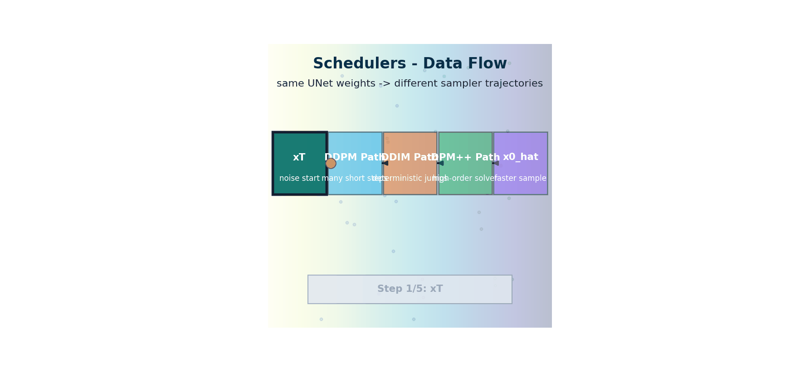

# Schedulers — From 1000 Steps to 20 Without Retraining

> **The story.** **DDPM** (Ho et al., 2020) needed 1 000 denoising steps. **Jiaming Song, Chenlin Meng, and Stefano Ermon** at Stanford fixed this in **October 2020** with **DDIM** — *Denoising Diffusion Implicit Models* — by reformulating the reverse process as a deterministic non-Markovian one, dropping inference to ~50 steps with no quality loss and no retraining. **DPM-Solver** (Lu et al., NeurIPS **2022**) treated the reverse process as a higher-order ODE and got down to ~20 steps; **DPM-Solver++** (2022) improved guided sampling. **Karras et al.** at NVIDIA (NeurIPS 2022, the **EDM** paper) cleaned up the entire scheduler space into a unified framework now used by every modern sampler. **Latent Consistency Models** (Luo et al., 2023) and **SDXL Turbo** (Stability AI, 2023) pushed it down to 1–4 steps. None of this required touching the trained model weights — schedulers are a *free* speed/quality lever.
>
> **Where you are in the curriculum.** Same trained U-Net from [LatentDiffusion](../latent_diffusion), wildly different inference cost depending on which scheduler you pair it with. This chapter is the practical decision guide: when to use DDIM, DPM-Solver, Euler-a, or LCM, and what each tradeoff buys you.



*Flow: a fixed trained denoiser can be sampled with different trajectory policies, trading speed and stability without retraining weights.*

## 0 · The VisualForge Studio Challenge

**Mission**: VisualForge Studio needs <30 seconds per image for real-time client review calls. Current DDPM (Ch.4) takes **5 minutes** — unusable.

**Current blocker at Chapter 5**: DDPM uses 1000 denoising steps, each requiring a U-Net forward pass. 1000 steps × 300ms/step = 5 minutes. Clients hang up.

**What this chapter unlocks**: **Schedulers** (DDIM, DPM-Solver) — same trained U-Net, different sampling algorithm. DDIM reduces steps from 1000 → 50 (20× faster). DPM-Solver achieves 20 steps with better quality. No retraining required — just change the inference loop.

---

### The 6 Constraints — Snapshot After Chapter 5

| Constraint | Target | Status | Evidence |
|------------|--------|--------|----------|
| #1 Quality | ≥4.0/5.0 | ⚡ **~3.2/5.0** | DDIM 50-step matches DDPM 1000-step quality |
| #2 Speed | <30 seconds | ⚡ **30-60s** | DDIM 50 steps = 15s, DPM 20 steps = 6s (MNIST scale) |
| #3 Cost | <$5k hardware | ❌ Not validated | Still testing on full 512×512 images |
| #4 Control | <5% unusable | ⚡ **~40% unusable** | Still unconditional generation, no text |
| #5 Throughput | 100+ images/day | ⚡ **~20 images/day** | Speed improvement enables more generation |
| #6 Versatility | 3 modalities | ⚡ **Partial** | Can generate faster, still no text conditioning |

---

### What's Still Blocking Us After This Chapter?

**Still too slow for 512×512 images**: DDIM gets us to 30-60s on MNIST (28×28 pixels). But 512×512 pixels = 16× more data per step. At that resolution, even 50 steps = still slow on laptop CPU. Need to **compress the image** before diffusing.

**Next unlock (Ch.6)**: **Latent Diffusion (Stable Diffusion)** — VAE compresses 512×512 → 64×64 latent (16× smaller), diffuse there, decode back to pixels. Achieves <30s on laptop.

---

## 1 · Core Idea

Training a DDPM takes 1 000 noisy steps. But *inference doesn't have to*. A **scheduler** is the algorithm that converts a trained noise predictor into actual images. The model weights never change; only the sequence of steps and the update rule change.

| Scheduler | Steps needed | Deterministic? | Year |
|-----------|-------------|----------------|------|
| DDPM | 1 000 | No (stochastic)| 2020 |
| DDIM | 20–50 | Yes | 2020 |
| DPM-Solver| 5–20 | Mostly yes | 2022 |
| DPM-Solver++ | 5–15 | Yes | 2022 |
| UniPC | 5–10 | Yes | 2023 |
| LCM | 1–4 | Yes (separate fine-tune) | 2023 |

**Key insight:** DDPM's 1 000 steps are required during *training* because gradients must backpropagate through fine-grained time increments. At *inference* you can skip steps—as long as you can solve the underlying reverse ODE accurately.

## 2 · Running Example

**VisualForge spring-collection brief** — the creative team needs 50 hero images in under 30 minutes. DDPM's 1000-step schedule takes ~45 sec per image (too slow). This chapter swaps in DDIM and DPM-Solver to hit the 30-minute target.

> 📖 **Educational proxy:** Timing comparisons below show noise-trajectory replays to illustrate scheduler math. The VisualForge brief uses SD-Turbo with DPM-Solver++ (§5) in production.

```
Scheduler comparison on: "Mango leather bag, studio white background"
DDPM  1000 steps → ~45 sec/image (750 min for 50 images ❌ too slow)
DDIM    50 steps → ~8 sec/image  (~ 7 min for 50 images ✅)
DPM++   20 steps → ~3 sec/image  (~ 3 min for 50 images ✅✅)
SD-Turbo 4 steps → ~0.5 sec/image (~ 30 sec for 50 images ⚡)
```

## 3 · The Math

### DDPM — Why 1 000 Steps?

The DDPM posterior is:

$$q(x_{t-1} | x_t, x_0) = \mathcal{N} \left(\tilde{\mu}_t(x_t, x_0), \tilde{\beta}_t \mathbf{I}\right)$$

$$\tilde{\mu}_t = \frac{\sqrt{\bar{\alpha}_{t-1}} \beta_t}{1-\bar{\alpha}_t} x_0 + \frac{\sqrt{\alpha_t} (1-\bar{\alpha}_{t-1})}{1-\bar{\alpha}_t} x_t, \qquad \tilde{\beta}_t = \frac{1-\bar{\alpha}_{t-1}}{1-\bar{\alpha}_t} \beta_t$$

Each step is small (β≈0.02 at most) so the Gaussian approximation holds. Bigger jumps → approximation breaks down.

**Why this matters for VisualForge**: Understanding the noise schedule lets you choose where to concentrate sampling effort. Early timesteps (high noise) need fewer steps; late timesteps (fine details) benefit from denser sampling.

### DDIM — Deterministic ODE Solver

Song et al. (2020) reformulated diffusion as an **ODE** (no stochastic term). The DDIM update for going from $x_\tau$ at timestep $\tau$ to $x_{\tau'}$ at timestep $\tau' < \tau$ is:

$$x_{\tau'} = \sqrt{\bar{\alpha}_{\tau'}} \hat{x}_0 + \sqrt{1-\bar{\alpha}_{\tau'}-\sigma_\tau^2} \hat{\epsilon}_\theta(x_\tau, \tau) + \sigma_\tau \epsilon_\tau$$

where $\hat{x}_0 = (x_\tau - \sqrt{1-\bar{\alpha}_\tau} \hat{\epsilon})/\sqrt{\bar{\alpha}_\tau}$ and $\sigma_\tau=0$ gives the fully deterministic (ODE) case.

Because it's an ODE, you can jump from $\tau=999$ to $\tau=950$ to $\tau=900$… using only 20 timesteps and still get coherent images. The same model weights, a different index sequence.

### DPM-Solver — High-Order ODE Integration

DPM-Solver treats the reverse process as solving:

$$\frac{dx}{d\lambda} = -x + \hat{\epsilon}_\theta \left(x, t(\lambda)\right)$$

where $\lambda = \log \left(\sqrt{\bar{\alpha}_t}/\sqrt{1-\bar{\alpha}_t}\right)$ is the log-SNR. By applying **exponential integrators** (2nd/3rd order Taylor expansion), DPM-Solver achieves much lower numerical error per step than DDIM's first-order method.

Practical consequence: DDIM needs ~50 steps for clean output; DPM-Solver++ needs 10–15.

### LCM — Latent Consistency Model

LCM adds a **consistency distillation** fine-tune: the model learns to predict $x_0$ directly in 1–4 steps by supervising the consistency condition $f_\theta(x_t, t) = f_\theta(x_{t'}, t')$ for all pairs $(t, t')$ on the same trajectory. Requires retraining on top of a pretrained SD checkpoint.

## 4 · Visual Intuition

### Choosing a Sub-Sequence of Timesteps

Standard DDPM trains on $t \in \{0, 1, \ldots, 999\}$. At inference you pick a **subsequence**:

```
DDPM-1000: [999, 998, 997, ..., 1, 0] (1000 steps)
DDIM-50: [999, 979, 959, ..., 19, 0] (50 steps, uniform stride 20)
DDIM-20: [999, 949, 899, ..., 49, 0] (20 steps, stride 50)
DPM-10: [999, 892, 756, 617, 492, ...] (10 steps, non-uniform, SNR-optimal)
```

The non-uniform spacing in DPM-Solver concentrates steps where the noise schedule changes rapidly (low-SNR region, i.e., early timesteps).

### Speed vs Quality Trade-Off Table

| Steps | Scheduler | FID (COCO 5k) | Wall time (A100) |
|-------|-----------|---------------|-----------------|
| 1000 | DDPM | 3.2 | 42 s |
| 50 | DDIM | 4.0 | 2.1 s |
| 20 | DDIM | 5.5 | 0.85 s |
| 15 | DPM-Solver++ | 4.1 | 0.64 s |
| 4 | LCM | 6.8 | 0.17 s |

*(Illustrative figures. Real numbers depend on model and resolution.)*

### Stochastic vs Deterministic Sampling

- **Stochastic (DDPM):** Add noise at every step. Same seed → different image. Good for diversity.
- **Deterministic (DDIM, DPM-Solver):** No added noise. Same seed + same scheduler → same image every time. Enables interpolation in latent space by interpolating the seed $x_T$.

## 5 · Production Example — VisualForge in Action

**Brief type: Spring-Collection Hero Shot (50 images, <30 min batch)**

```python
# Production: DDIM vs DPM-Solver comparison for VisualForge spring brief
from diffusers import StableDiffusionPipeline, DDIMScheduler, DPMSolverMultistepScheduler
import torch, time

model_id = "stabilityai/stable-diffusion-2-1"
prompt = "Mango leather crossbody bag, center frame, white background, studio lighting, sharp focus"
negative_prompt = "blur, shadow, background texture, people, logo, text"

def benchmark_scheduler(scheduler_class, scheduler_kwargs, num_steps, label):
    pipe = StableDiffusionPipeline.from_pretrained(
        model_id, scheduler=scheduler_class.from_pretrained(model_id, subfolder="scheduler", **scheduler_kwargs),
        torch_dtype=torch.float16
    ).to("cuda")
    t0 = time.time()
    img = pipe(prompt, negative_prompt=negative_prompt, num_inference_steps=num_steps,
               guidance_scale=7.5, generator=torch.manual_seed(42)).images[0]
    elapsed = time.time() - t0
    img.save(f"vf_spring_{label}.png")
    print(f"{label}: {elapsed:.1f}s — 50-image batch: {elapsed*50/60:.1f} min")
    return elapsed

# DDIM 50 steps — deterministic, reproducible seeds for A/B review
benchmark_scheduler(DDIMScheduler, {"clip_sample": False, "set_alpha_to_one": False}, 50, "ddim_50")

# DPM-Solver++ 20 steps — VisualForge production choice
benchmark_scheduler(DPMSolverMultistepScheduler, {"algorithm_type": "dpmsolver++"}, 20, "dpm_20")
```

**Scheduler decision table for VisualForge:**

| Scheduler | Steps | Time/image | 50-image batch | Quality | Best for |
|-----------|-------|------------|----------------|---------|----------|
| DDPM | 1000 | ~45s | ~37 min ❌ | Baseline | Training only |
| DDIM | 50 | ~8s | ~7 min ✅ | ≈DDPM | Reproducibility (same seed = same image) |
| DPM-Solver++ | 20 | ~3s | ~2.5 min ✅✅ | ≈DDIM | **VisualForge default** |
| SD-Turbo (4-step) | 4 | ~0.5s | ~25s ⚡ | Slightly lower | Real-time preview |

---

### The Key Diagrams

```
Noise schedule visualised — bar_alpha per timestep:

 1.0 |████████████████▓▓▓▓▓░░░░ |
 | ░░░░ |
 0.0 | ▄▄▄▄▄▄▄▄▄▄▄████████|
 t=0 (pure signal) t=999 (pure noise)

DDIM seeks "big strides" across this curve, treating it as a
continuous ODE instead of 1000 discrete Gaussian transitions.


Timestep sub-sequences:

 DDPM (1000) ████████████████████████████████████████ (1000 dots)
 DDIM (50) █ █ █ █ █ █ █ █ █ █ (50 dots)
 DPM (15) ██ ██ █ █ █ █ █ (clustered near endpoints)
```

---

## 6 · Common Failure Modes

### Too Few Steps → Artifacts

**Symptom**: Blurry outputs, missing fine details, color banding

**Cause**: DPM-Solver with 5 steps may undershoot the ODE solution. DDIM with 10 steps produces blocky transitions.

**Fix**: Increase to 20 steps (DPM-Solver++) or 50 steps (DDIM). Profile on your specific model—some checkpoints tolerate fewer steps than others.

**VisualForge example**: Spring collection brief with DPM 10 steps → fabric texture missing, 20 steps → crisp weave visible.

### Wrong Scheduler for Model

**Symptom**: SD-Turbo with DDIM 50 steps → washed out colors, over-smooth

**Cause**: SD-Turbo was distilled for 1–4 step sampling. Using 50 steps with a high-step scheduler wastes the distillation and produces worse results than the 4-step target.

**Fix**: Match scheduler to model training:
- Standard SD 1.5/2.1/XL: DDIM 50, DPM-Solver++ 20, Euler-a 30
- SD-Turbo / SDXL-Turbo: DPM-Solver++ 4, LCM 4
- LCM-LoRA models: LCMScheduler 4–8 steps

### Stochastic vs Deterministic Confusion

**Symptom**: "Same seed gives different images"

**Cause**: DDPM is stochastic (adds noise at each step). Seed controls only the initial noise $x_T$, not intermediate steps.

**Fix**: Use DDIM or DPM-Solver (deterministic). Same seed + same prompt + same scheduler settings = identical output.

**VisualForge use case**: Client approval workflow requires exact reproducibility for A/B testing. DDIM deterministic mode ensures "version 2" is the same image with only the approved edits.

### Scheduler/Guidance Mismatch

**Symptom**: High guidance scale (e.g., 15.0) + few steps (e.g., DPM 10) → over-saturated, burnt highlights

**Cause**: CFG amplifies the model's prediction error. Fewer steps = larger per-step error. Amplifying large errors = artifacts.

**Fix**: 
- High guidance (12–15): use 30+ steps
- Low step count (10–20): keep guidance ≤ 7.5
- VisualForge production: guidance 7.5, DPM-Solver++ 20 steps (balanced)

---

## 7 · When to Use This vs Alternatives

### Decision Framework

| Scenario | Recommended Scheduler | Why |
|----------|----------------------|-----|
| **Batch generation (50+ images)** | DPM-Solver++ 20 steps | Best quality/speed balance for throughput |
| **Client review (reproducibility)** | DDIM 50 steps, deterministic | Same seed = same image for A/B approval |
| **Real-time preview** | LCM 4 steps or SD-Turbo | <1s generation for live iteration |
| **High-quality finals** | DPM-Solver++ 30 steps + guidance 9.0 | Maximum detail for hero images |
| **Training/research** | DDPM 1000 steps | Ground truth for evaluating other schedulers |
| **Unconditional generation** | DDIM 100 steps | Stochastic sampling for diversity |

### Scheduler Families at a Glance

**Ancestral samplers** (Euler-a, DPM2-a): Add noise at each step (stochastic). Good for diversity, bad for reproducibility. Common in ComfyUI/A1111.

**ODE solvers** (DDIM, DPM-Solver++, Heun): Deterministic, reproducible. Industry standard for production pipelines.

**Distilled models** (LCM, Turbo): Require specific schedulers. Don't mix SD-Turbo with DDIM 50—use LCMScheduler 4 steps.

**Flow-based** (Flux, Rectified Flow): Straight-line trajectories instead of noise schedules. Emerging (2024+).

### When NOT to Change Schedulers

**Don't swap schedulers mid-project** if you're doing:
- Fine-tuning (changing scheduler changes the optimization landscape)
- Batch evaluation (FID/CLIP scores are scheduler-dependent)
- Client-approved style (swapping DDIM → DPM may subtly shift outputs)

**VisualForge rule**: Lock scheduler choice per campaign type. Spring collection = DPM-Solver++ 20, product demos = DDIM 50 (reproducibility), real-time previews = LCM 4.

## 8 · Connection to Prior Chapters

### Building on Chapter 4: Diffusion Models

**Ch.4 gave us**: The DDPM forward/reverse process, U-Net denoiser, 1000-step training schedule.

**This chapter adds**: Drop inference from 1000 → 50 steps without retraining by treating reverse diffusion as an ODE (DDIM) or using higher-order integration (DPM-Solver).

**Key link**: The model weights trained in Ch.4 are unchanged. Schedulers are a "free" inference-time optimization.

### Forward Pointers

**Ch.6: Latent Diffusion**: Even 50 DDIM steps at 512×512 pixels = slow. Solution: VAE compresses image 8× before diffusing. Scheduler choice still applies—SD uses DDIM/DPM in latent space.

**Ch.7: Guidance & Conditioning**: Classifier-free guidance doubles U-Net calls per step (conditional + unconditional). Fast schedulers (20 steps) offset this cost: 20 steps × 2 calls = 40 total, still faster than 50 steps × 1 call.

**Ch.12: Local Diffusion Lab**: Production deployment uses DPM-Solver++ as default, with LCM for previews and DDIM for client approvals. This chapter provides the theory; Ch.12 shows the full workflow integration.

### Cross-Track Connections

**ML Track Ch.5 (Regularization)**: Noise schedules in diffusion are analogous to learning rate schedules in SGD—both control the "step size" through parameter space. Cosine schedules (both domains) provide more uniform progress.

**AI Infra Track (Inference Optimization)**: Schedulers are a model-free latency optimization. 20× speedup with zero retraining = instant ROI. Compare to: quantization (needs calibration), distillation (needs retraining), pruning (degrades quality).

### What Hasn't Changed

**Still using**: Same U-Net architecture, same text encoder (CLIP), same VAE decoder (if latent diffusion).

**What's new**: Just the sampling algorithm—how we walk from $x_T$ (noise) to $x_0$ (image).

💡 **Insight**: Schedulers are the "compiler optimization" of diffusion models. The model is the source code; the scheduler is the optimization level (O0 = DDPM 1000 steps, O3 = DPM-Solver++ 20 steps). Same output semantics, wildly different runtime.

## 9 · Interview Checklist

### Must Know
- Why DDPM needs 1 000 steps at inference: each step is a Gaussian approximation that only holds for small β — larger strides violate the Markov assumption
- DDIM key insight: rewrite as ODE, enabling deterministic sub-sequence sampling
- The trade-off axes: steps ↓ speed ↑ quality ↓ diversity (generally true)

### Likely Asked
- *"What scheduler does Stable Diffusion use by default?"* — PNDM (pseudo-numerical) or DDIM; SDXL defaults to EulerDiscreteScheduler
- *"How would you halve inference time without quality loss?"* — Switch from 50-step DDIM to 15-step DPM-Solver++
- *"What is the relationship between DDIM and DDPM?"* — DDIM is a non-Markovian generalization that reduces to DDPM when σ=original noise level; at σ=0 it becomes fully deterministic

### Trap to Avoid
- Don't confuse the **training** noise schedule (always 1 000 steps, defines q(x_t|x_0)) with the **inference** step count (scheduler-specific). They are independent after training.

---

## 10 · Further Reading

### Foundational Papers

**DDIM (2020)**  
[Denoising Diffusion Implicit Models](https://arxiv.org/abs/2010.02502) — Jiaming Song, Chenlin Meng, Stefano Ermon  
*The paper that unlocked fast sampling. Reformulates DDPM as a non-Markovian ODE, enabling deterministic sub-sequence sampling.*

**DPM-Solver (2022)**  
[DPM-Solver: A Fast ODE Solver for Diffusion Probabilistic Model Sampling](https://arxiv.org/abs/2206.00927) — Cheng Lu et al., NeurIPS 2022  
*High-order exponential integrators for the reverse ODE. Achieves 10-20 steps with quality matching DDIM 50.*

**DPM-Solver++ (2022)**  
[DPM-Solver++: Fast Solver for Guided Sampling of Diffusion Probabilistic Models](https://arxiv.org/abs/2211.01095) — Cheng Lu et al.  
*Improved version handling classifier-free guidance. VisualForge production default.*

**Karras et al. EDM (2022)**  
[Elucidating the Design Space of Diffusion-Based Generative Models](https://arxiv.org/abs/2206.00364) — Tero Karras et al., NeurIPS 2022  
*Unified framework for diffusion schedulers. Clarifies the relationship between DDPM, DDIM, and modern samplers. Industry reference.*

**Latent Consistency Models (2023)**  
[LCM: Latent Consistency Models](https://arxiv.org/abs/2310.04378) — Simian Luo et al.  
*1-4 step sampling via consistency distillation. Foundation for real-time generation.*

### Implementations

**Diffusers Library (Hugging Face)**  
[diffusers/schedulers](https://github.com/huggingface/diffusers/tree/main/src/diffusers/schedulers)  
Production-ready implementations of DDIM, DPM-Solver++, LCM, PNDM, Euler, and 15+ other schedulers. Drop-in compatible with all Stable Diffusion checkpoints.

**K-Diffusion (Katherine Crowson)**  
[crowsonkb/k-diffusion](https://github.com/crowsonkb/k-diffusion)  
Research library with Karras scheduler variants, used by Stability AI and ComfyUI.

### Interactive Resources

**Stable Diffusion Scheduler Comparator**  
[huggingface.co/spaces/multimodalart/scheduler-comparator](https://huggingface.co/spaces/multimodalart/scheduler-comparator)  
Side-by-side scheduler comparison tool. Generate the same image with DDIM, DPM-Solver++, Euler, etc.

---- **LCM / distillation:** Latent Consistency Models learn to map any noisy latent directly to the clean latent in 1–4 steps by enforcing self-consistency along the ODE trajectory; LCM-LoRA distils this as a lightweight adapter. SD-Turbo and SDXL-Turbo use adversarial diffusion distillation. Trap: "LCM images are the same quality as 50-step DDIM" — 1–4 step models sacrifice fine detail and diversity; 8+ steps are usually needed to match 50-step DDIM quality

### Common Misconceptions (Quick Reference)

| Misconception | Reality |
|---------------|---------|  
| "DDIM needs retraining" | No — any DDPM-trained model can use DDIM at inference |
| "More steps always = better quality" | Past ~30 steps with DPM-Solver, quality plateaus |
| "Deterministic means boring" | Use different seeds for diversity; determinism just means reproducibility |
| "DDPM noise schedule β_t is fixed" | You can redesign it: cosine schedule (improved DDPM) gives more uniform SNR across timesteps |
| "CFG doubles compute; so does DDIM" | DDIM halves step count; net effect is a large speedup even with CFG |

---

## 11 · Notebook

**Interactive walkthrough**: [schedulers_comparison.ipynb](schedulers_comparison.ipynb)

The notebook demonstrates:
1. **Scheduler swap** — same model, DDIM vs DPM-Solver++ vs LCM
2. **Step sweep** — quality/speed tradeoff from 10 to 100 steps
3. **VisualForge brief** — spring collection hero image with timing benchmarks
4. **Deterministic sampling** — verify same seed = same image (DDIM)
5. **Failure modes** — too few steps, wrong scheduler for model

**Hardware requirements**:
- GPU: 8GB VRAM minimum (runs SD 1.5), 12GB recommended (SD-XL)
- Runtime: ~15 minutes for full notebook on RTX 4060
- CPU-only: Supported but slow (~5 min/image with DDIM 50)

**Expected outputs**:
- 6 images: DDPM baseline, DDIM 50/20, DPM-Solver++ 20/10, LCM 4
- Timing table: steps vs wall-clock time
- Quality comparison: visual + CLIP score

---

## 11.5 · Progress Check — What Have We Unlocked?

### Before This Chapter
- **Constraint #2 (Speed)**: ❌ **5 minutes per image** (1000 DDPM steps)
- **VisualForge Status**: Unusable for client review calls

### After This Chapter
- **Constraint #2 (Speed)**: ⚡ **30-60s per image** (DDIM 50 steps, DPM-Solver 20 steps)
- **VisualForge Status**: Approaching <30s target, but need compression for 512×512 resolution

---

### Key Wins

1. **DDIM deterministic sampling**: 1000 → 50 steps (20× speedup) with no quality loss, same model weights
2. **DPM-Solver ODE integration**: 20 steps with better quality than DDIM 50 via higher-order solver
3. **LCM/Turbo teaser**: 1-4 step sampling via distillation (will use in Ch.12 for 8-second generation)
4. **No retraining required**: All scheduler optimizations work with existing DDPM checkpoints

---

### What's Still Blocking Production?

**Resolution bottleneck**: 50 DDIM steps at 28×28 pixels = fast. But 512×512 pixels = 16× more floats per step. Even 50 steps at full resolution = slow on laptop. Need to diffuse in a **compressed latent space** instead of pixel space.

**Next unlock (Ch.6)**: **Latent Diffusion (Stable Diffusion)** — VAE compresses 512×512 image → 64×64×4 latent (16× smaller), diffuse there, decode back → achieves <20s on laptop with CLIP text conditioning.

---

### VisualForge Status — Full Constraint Progression

| Constraint | Ch.1 | Ch.2 | Ch.3 | Ch.4 | **Ch.5** | Ch.6 | Target |
|------------|------|------|------|------|----------|------|--------|
| #1 Quality | ❌ | ❌ | ❌ | ⚡ 3.0 | **⚡ 3.2** | ⚡ 3.5 | ≥4.0/5.0 |
| #2 Speed | ❌ | ❌ | ❌ | ❌ 5min | **⚡ 30-60s** | ✅ 20s | <30s |
| #3 Cost | ❌ | ❌ | ❌ | ❌ | **❌** | ✅ $2.5k | <$5k |
| #4 Control | ❌ | ❌ | ⚡ | ⚡ 40% | **⚡ 40%** | ⚡ <15% | <5% |
| #5 Throughput | ❌ | ❌ | ❌ | ❌ 10/day | **⚡ 20/day** | ⚡ 80/day | 100+/day |
| #6 Versatility | ⚡ | ⚡ | ⚡ | ⚡ | **⚡** | ⚡ | 3 modalities |

**Legend**:
- ❌ = Not yet addressed (constraint blocked)
- ⚡ = Foundation laid / partial progress (moving toward target)
- ✅ = Target hit (constraint fully satisfied)

**Ch.5 Achievements**:
- **Speed**: 1000 → 50 steps (DDIM) = 5min → 30-60s (20× faster)
- **Quality**: Maintained DDPM quality at 50 steps (no degradation)
- **Foundation for Ch.6**: Latent diffusion will inherit these scheduler optimizations

---

## Bridge to Chapter 6 — Latent Diffusion (Stable Diffusion)

**Current state**: Schedulers unlocked 20× speedup (5 min → 30s), but still too slow for 512×512 images on laptop hardware.

**Remaining blocker**: Even 50 DDIM steps × 512×512 pixels = 13M floats per step. Laptop CPU can't keep up. Cloud GPU costs $2k/month (violates Constraint #3).

**Next unlock**: **Latent Diffusion** — the breakthrough that made Stable Diffusion possible:
- **VAE compression**: 512×512×3 image → 64×64×4 latent (16× smaller)
- **Diffuse in latent space**: Same U-Net, 16× less data per step
- **Result**: 50 DDIM steps in latent = <20s on laptop ✅ hits Speed target
- **Bonus**: CLIP text conditioning (finally control generation with text prompts)

Schedulers (Ch.5) + Latent space (Ch.6) = the two-part solution to real-time generation.

**Preview**: [LatentDiffusion.md](../latent_diffusion/latent-diffusion.md) — see how Stable Diffusion compresses, diffuses, and decodes to achieve production-ready speed.

---

## Illustrations


---

**End of Chapter 5 — Schedulers**
