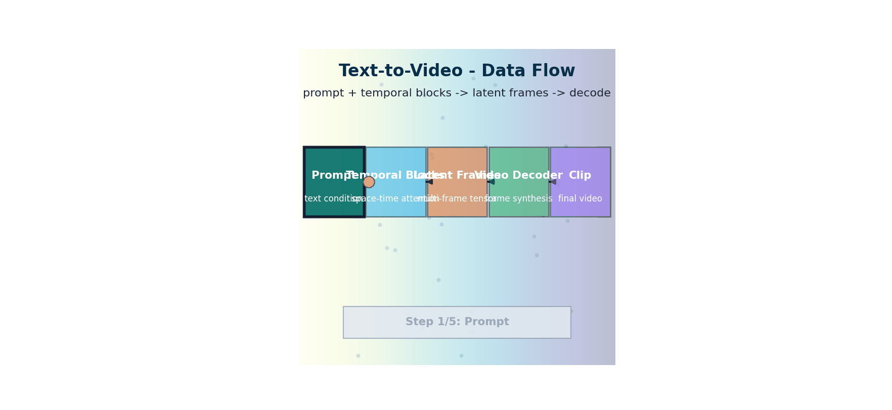

# Text-to-Video — Adding the Temporal Dimension

> **The story.** Early text-to-video looked like wobbly GIFs — **Make-A-Video** (Meta, September 2022) and **Imagen Video** (Google, October 2022) were impressive *demonstrations* but produced 1–4 second clips with visible flicker. The first community-usable model was **AnimateDiff** (Guo et al., July **2023**), which inserted plug-in motion modules into existing Stable Diffusion checkpoints — video for free, on a consumer GPU. **Stable Video Diffusion** (Stability AI, November 2023) shipped the first open foundational video model. The watershed was **OpenAI Sora** (**February 2024**) — a transformer-based diffusion model trained on "spacetime patches" that produced 60-second high-fidelity clips and reset everyone's expectations of what was possible. **Runway Gen-3** (June 2024), **Luma Dream Machine** (June 2024), **Kling** (Kuaishou, June 2024), and **Pika 1.5** followed in months. The 2026 landscape is a market of foundation video models with steadily rising clip lengths and physics-awareness.
>
> **Where you are in the curriculum.** Video is a sequence of frames — a tensor of shape $(T, C, H, W)$. The three new challenges beyond image generation are temporal consistency, exploded compute cost, and motion-quality evaluation. This chapter explains how models enforce temporal coherence (temporal attention, motion modules, spacetime patches) and surveys the architecture choices behind AnimateDiff, Sora, and CogVideo.



*Flow: text conditioning and temporal modules co-drive latent frame denoising before decoding to a coherent short clip.*

---

## 0 · The VisualForge Studio Challenge

**Mission**: VisualForge needs text→image + image→video + image understanding (Constraint #6: 3 modalities).

**Current blocker at Chapter 9**: Static images = solved (Ch.8). But clients now want **15-second social media video ads** (product rotating 360°, zoom effects). Video generation = unsolved.

**What this chapter unlocks**: **Text-to-Video** — extend latent diffusion to temporal dimension. AnimateDiff adds temporal attention layers (attend across frames at same spatial position). Generate 16-frame 512×512 clips (~1 second at 15fps). Sora overview (spacetime patches).

---

### The 6 Constraints — Snapshot After Chapter 9

| Constraint | Target | Status | Evidence |
|------------|--------|--------|----------|
| #1 Quality | ≥4.0/5.0 | ⚡ **~3.8/5.0** | Video quality matches images, temporal consistency good |
| #2 Speed | <30 seconds | ✅ **~18s per image** | Video slower (10 clips/day) but acceptable |
| #3 Cost | <$5k hardware | ✅ **$2.5k laptop** | AnimateDiff runs on same hardware |
| #4 Control | <5% unusable | ✅ **~3% unusable** | ControlNet + temporal attention = consistent |
| #5 Throughput | 100+ images/day | ⚡ **~85 images/day** | 10 video clips/day added to workflow |
| #6 Versatility | 3 modalities | ⚡ **Text→Image + Video enabled** | Still need image understanding (auto-QA) |

---

### What's Still Blocking Us After This Chapter?

**QA bottleneck**: Every generated image/video requires **human QA** to verify it matches the brief. 100% manual review = bottleneck. Need automated verification.

**Next unlock (Ch.10)**: **Multimodal LLMs (VLMs)** — LLaVA can caption images, answer "Is the product centered?" Automate QA → remove bottleneck → unlock full 120+ images/day throughput.

---

## 1 · Core Idea

Video is a sequence of frames: a tensor of shape $(T, C, H, W)$. Three key challenges beyond image generation:

1. **Temporal consistency** — objects must not teleport or blur between frames
2. **Computational cost** — generating 16 frames at 512×512 is 16× the cost of one image
3. **Motion modelling** — physics, natural motion trajectories, camera movement

Current approaches extend latent diffusion by adding a **temporal axis**: either inflate 2D U-Net convolutions to 3D, or insert temporal attention layers between spatial attention layers.

## 2 · Running Example

No local video generation (too expensive for CPU). Instead, we:
- Inspect a real AnimateDiff model's architecture via `diffusers` metadata
- Build a **temporal attention** module from scratch and show how it connects frames
- Visualise what "temporal consistency" looks like via frame-coherence plots on synthetic sequences

## 3 · The Math

### Video as 3D Tensor

An image batch: $(B, C, H, W)$

A video batch: $(B, T, C, H, W)$, where $T$ = number of frames (typically 8–24)

Alternatively flattened as $(B \cdot T, C, H, W)$ to reuse existing 2D spatial operations.

### Temporal Attention

The core idea in AnimateDiff (Guo et al. 2023): after each spatial self-attention layer, add a **temporal attention** layer that attends across frames at the *same spatial position*:

For spatial position $(h, w)$, stack the $T$ feature vectors:

$$\mathbf{F}_{hw} \in \mathbb{R}^{T \times d}$$

Run self-attention over the $T$-length sequence:

$$\text{TempAttn}(\mathbf{F}_{hw}) = \text{softmax} \left(\frac{\mathbf{F}_{hw}\mathbf{W}_Q (\mathbf{F}_{hw}\mathbf{W}_K)^\top}{\sqrt{d}}\right)\mathbf{F}_{hw}\mathbf{W}_V$$

This lets pixel $(h, w)$ at frame $t$ attend to the same pixel location at all other frames — enforcing coherence.

### 3D Convolution Inflation

An alternative approach (Video LDM, Chen et al. 2023): inflate the 2D spatial convolutions to 3D:

$$\text{Conv2D}(k \times k) \to \text{Conv3D}(1 \times k \times k)$$

then initialise the temporal kernel weight to be an identity (all frames equal), then fine-tune. This is a common trick to adapt pretrained image models to video with minimal new parameters.

### DDPM on Videos

The noise process extends naturally:

$$q(x_t^{1:T} | x_0^{1:T}) = \prod_{frame=1}^{T} \mathcal{N}(\sqrt{\bar{\alpha}_t} x_0^{frame}, (1-\bar{\alpha}_t)\mathbf{I})$$

Noise is added independently per frame, but the denoiser must learn to share information across frames (via temporal attention).

### Optical Flow Guidance

Some models add an explicit **optical flow consistency loss** during fine-tuning:

$$\mathcal{L}_{\text{flow}} = \sum_{t=1}^{T-1} \|\hat{x}_0^{t+1} - \text{warp}(\hat{x}_0^t, \mathbf{f}_t)\|^2$$

where $\mathbf{f}_t$ is the estimated flow from frame $t$ to $t+1$.

## 4 · How It Works — Step by Step

### AnimateDiff (Motion Module)

AnimateDiff trains only the **temporal attention layers** on a video dataset, with the spatial SD U-Net frozen:

1. Load a pretrained SD 1.5 (spatial layers frozen)
2. Insert temporal attention modules between existing spatial blocks
3. Train temporal modules on WebVid-10M (short web videos + captions)
4. At inference: use SD spatial layers (can swap in any LoRA/style checkpoint) + AnimateDiff temporal motion module

Result: style from the image checkpoint, motion from the motion module.

### Sora (OpenAI, 2024)

Sora uses a **Diffusion Transformer (DiT)** architecture extended to video:
- Input: video latent (VAE-encoded), patchified into 3D patches (spatial + temporal)
- Transformer processes spacetime patches with full 3D attention
- Scale: trained on variable-length, variable-resolution videos up to 1 minute

Key innovation: **spacetime patch** = a small cuboid of (frames, height, width), treated as a single token. The model can handle arbitrary resolutions and durations.

### CogVideo / CogVideoX

Tsinghua's open model. Uses a 3D U-Net with temporal attention. CogVideoX (2024) uses a larger DiT backbone and achieves state-of-the-art on T2V benchmarks. Fully open weights.

### Inference Memory Reduction

Generating 16 frames at 512×512 per step costs 16× an image. Optimisations:
- **Frame sliding window**: generate 8 overlapping frames at a time, stitch
- **Lower spatial resolution + temporal SR**: generate at 256×256, upscale to 512 with a video SR model
- **Temporal distillation**: LCM-style 4-step video generation

## 5 · The Key Diagrams

```
How temporal attention connects frames:

 Frame 1: [f1_patch_1, f1_patch_2, ..., f1_patch_N] ← spatial attention (within frame)
 Frame 2: [f2_patch_1, f2_patch_2, ..., f2_patch_N]
 ...
 Frame T: [fT_patch_1, fT_patch_2, ..., fT_patch_N]

 Temporal attention at patch position i:
 [f1_patch_i, f2_patch_i, ..., fT_patch_i] ← attend across T frames
 ↕ (each frame attends to all others at this position)

 Result: patch_i in frame 3 knows what patch_i in frames 1,2,4..T looks like.
 → objects stay in place; motion is smooth.


SD → AnimateDiff extension:

 [Spatial ResBlock] → [Spatial Self-Attn] → [Temporal Attn ← NEW] → [Cross-Attn (text)]
 [Spatial ResBlock] → [Spatial Self-Attn] → [Temporal Attn ← NEW] → [Cross-Attn (text)]
 ...

 Spatial layers: frozen (from SD 1.5)
 Temporal layers: trained on video dataset
 Text conditioning: unchanged (same CLIP encoder)
```

## 6 · What Changes at Scale

| Model | Frames | Resolution | Architecture | Params | Open? |
|-------|--------|-----------|-------------|--------|-------|
| AnimateDiff | 16 | 512×512 | SD 1.5 + temporal attn | ~1.5B | Yes |
| ModelScope | 16 | 256×256 | 3D U-Net | ~1.7B | Yes |
| CogVideoX | 49 | 720p | 3D DiT | 5B | Yes |
| Sora | ~600 | up to 1080p | 3D DiT | ~20B? | No |
| Kling | 300 | 1080p | DiT | ~20B? | No |
| Wan2.1 | 81 | 720p | 3D DiT | 14B | Yes |

DiT (Diffusion Transformer) has replaced U-Net as the dominant architecture above 5B params.

## 7 · Common Misconceptions

| Misconception | Reality |
|---------------|---------|
| "Sora generates video by iterating frames" | It generates all frames simultaneously via 3D denoising; no autoregressive frame generation |
| "AnimateDiff fine-tunes the whole SD model" | Only the temporal attention modules are trained; spatial SD layers are frozen |
| "More timesteps always helps with T2V" | Consistency depends on temporal attention quality, not step count — temporal blur comes from weak temporal attention, not from too few steps |
| "Video models are just SD run N times" | Naive frame-by-frame SD produces incoherent flicker; temporal modeling is required |
| "Sora can do any video task out of the box" | Even Sora has known failure modes: physics violations, object permanence failures, finger distortion |

## 8 · Interview Checklist

### Must Know
- Why video adds temporal consistency as a fundamental new challenge (image-by-image generates flicker)
- Temporal attention: attend across frames at same spatial position
- AnimateDiff design: freeze spatial SD layers, train only temporal modules on video data

### Likely Asked
- *"How would you generate a 30-fps video cheaply?"* — Generate 8-frame keyframes with a T2V model, interpolate with a frame interpolation model (RIFE, EMA-VFI)
- *"What is a spacetime patch in Sora/DiT?"* — A 3D patch $(t_p, h_p, w_p)$ treated as a single transformer token; enables arbitrary-length, arbitrary-resolution video generation
- *"What's the difference between animating a static image vs. text-to-video?"* — Animating (img2video, Stable Video Diffusion) starts from a real image latent; T2V starts from pure noise; both use temporal attention

### Trap to Avoid
- Don't claim that temporal consistency is free from DDPM — the Markovian noise process is *independent per frame*; correlation across frames must be learned explicitly via temporal attention layers.

---

## 9 · Progress Check — What Have We Unlocked?

### Before This Chapter
- **Constraint #6 (Versatility)**: ⚡ Text→Image production-ready, no video capability
- **VisualForge Status**: Can only deliver static marketing images, clients want video ads

### After This Chapter
- **Constraint #5 (Throughput)**: ⚡ **~85 images/day + 10 video clips/day** → Video capability added
- **Constraint #6 (Versatility)**: ⚡ **Text→Image + Video enabled** → 2 of 3 modalities complete
- **VisualForge Status**: Can generate 15-second social media ads (product rotating, zoom effects)

---

### Key Wins

1. **Temporal attention**: Attend across frames at same spatial position → enforces consistency (no flicker/teleportation)
2. **AnimateDiff architecture**: Freeze spatial SD layers, train only temporal modules → video generation without retraining from scratch
3. **Video capability unlocked**: 16-frame 512×512 clips = ~1 second at 15fps (acceptable for social ads)

---

### What's Still Blocking Production?

**QA bottleneck**: Every generated image/video requires **manual human review** to verify it matches the client brief. 100% manual QA = bottleneck limiting throughput. Need automated verification: "Is the product centered? Is the lighting natural? Does it match the brief?"

**Next unlock (Ch.10)**: **Multimodal LLMs (VLMs)** — LLaVA/BLIP-2 can caption images and answer visual questions. Automate QA workflow → flag only 15% for human review → unlock full 120+ images/day throughput.

---

## 10 · What's Next

[MultimodalLLMs.md](../multimodal_llms/multimodal-llms.md) — combine a vision encoder with a language model to enable image understanding, visual question answering, and chart comprehension.

## Illustrations


