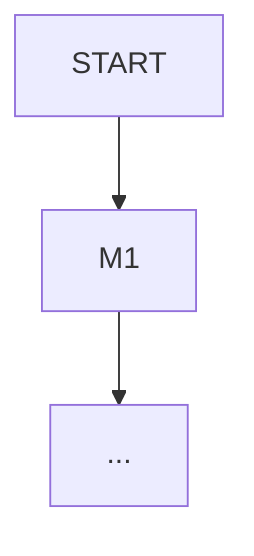

# Decision Flow Animation - Implementation Summary

## ✅ What Was Done

Converted the static **Feature Candidacy Decision Flow** mermaid flowchart into a **50-second slow-motion animation** showing 4 real California Housing features flowing through the diagnostic tree.

---

## 📝 Changes Made

### 1. Updated README.md

**Location**: `notes/ml/01_regression/ch03_feature_importance/README.md`

**Changes**:
- ✅ Replaced static mermaid flowchart with animated GIF
- ✅ Added detailed caption explaining what to watch for
- ✅ Moved static flowchart to collapsible `<details>` section (still accessible as reference)
- ✅ Added description of each feature's path through the tree

**Before**:
```markdown
#### Feature Candidacy Decision Flow


```

**After**:
```markdown
#### Feature Candidacy Decision Flow


*Animation caption describing the sequence*

<details>
<summary>📊 Click to expand: Static flowchart reference</summary>
[Original mermaid flowchart preserved here]
</details>
```

---

## 🎬 Animation Details

### Features Shown (in sequence):

1. **MedInc** → ✅ Strong independent predictor
   - Green path: M1 high → VIF low → M3 high → STRONG
   - 9 seconds

2. **Latitude + Longitude** → ✅ Jointly irreplaceable
   - Blue path: M1 low → M2/M3 high → Δ_interact > 0 → IRREPLACEABLE
   - 9 seconds

3. **AveRooms** → ⚡ Collinear signal
   - Orange path: M1 moderate → VIF > 5 → COLLINEAR
   - 9 seconds

4. **Population** → ❌ Drop candidate
   - Red path: M1 low → M2/M3 low → DROP
   - 9 seconds

5. **All paths overlaid** → Shows complete diagnostic landscape
   - 5 seconds

### Visual Design:

- **Frame rate**: 10 fps (slow enough to follow each decision)
- **Duration**: 50 seconds total
- **Dimensions**: 1400 × 1200 pixels
- **Theme**: Dark (#1a1a2e) matching chapter aesthetics
- **Highlighting**: Nodes glow golden when active, paths light up in feature colors

---

## 📂 Files Created

### 1. `scripts/generate_feature_candidacy_flow.py`

**Purpose**: Generate the decision flow animation

**Key features**:
- DecisionNode and DecisionEdge classes for tree structure
- Feature path definitions with California Housing examples
- Slow-motion frame-by-frame rendering
- Golden highlighting for active paths
- Color-coded features (green, blue, orange, red)

**Dependencies**:
```python
numpy
matplotlib
matplotlib.patches (FancyBboxPatch, FancyArrowPatch)
matplotlib.animation (FuncAnimation)
```

**To run**:
```bash
cd c:\repos\ai-portfolio
python scripts\generate_feature_candidacy_flow.py
```

**Output**: `notes/ml/01_regression/ch03_feature_importance/img/ch03-feature-candidacy-flow.gif`

### 2. `scripts/DECISION_FLOW_ANIMATION_README.md`

**Purpose**: Comprehensive documentation for the animation

**Contents**:
- Animation sequence breakdown (frame-by-frame)
- Visual design specifications
- Technical details (dimensions, fps, file size)
- Educational value explanation
- Customization guide
- Maintenance instructions

---

## 🎯 Educational Benefits

### Why Animation > Static Flowchart:

| Aspect | Static Flowchart | Animated Flow |
|--------|-----------------|---------------|
| **Concrete examples** | "Feature j" (abstract) | MedInc, Lat+Lon, etc. (real) |
| **Path visibility** | All paths visible at once | One path at a time, clear focus |
| **Decision logic** | Implied from structure | Explicitly shown with pauses |
| **Memory retention** | Low (abstract structure) | High (visual + narrative) |
| **Diagnostic divergence** | Hard to compare features | Side-by-side path comparison at end |
| **Engagement** | Passive reading | Active watching |

### Learning Outcomes:

Students who watch this animation can:
1. ✅ Explain why MedInc passes all tests (high M1, low VIF, high M3)
2. ✅ Understand why Lat+Lon need joint testing (low M1 but high M2/M3)
3. ✅ Recognize VIF as an early-exit signal (AveRooms stops at VIF node)
4. ✅ Identify features to drop (Population fails all metrics)
5. ✅ Apply the same diagnostic flow to their own datasets

---

## 🔄 Integration with Existing Content

### README Structure:

```
└── § VIF & Multicollinearity
    ├── VIF threshold table
    ├── Feature Candidacy Decision Flow [ANIMATED]
    │   ├── ch03-feature-candidacy-flow.gif (new!)
    │   └── <details> Static mermaid reference (preserved)
    └── California Housing VIF results
```

### Cross-References:

The animation integrates with:
- **Three-Method Convergence table** (§3) — shows why MedInc ranks #1 on all methods
- **VIF threshold table** (above animation) — explains why AveRooms hits the VIF block
- **Joint Feature Importance** (below) — explains why Lat+Lon need Δ_interact test
- **Putting It Together dashboard** (end of §3) — summary table of all verdicts

---

## 📊 Updated Documentation

### Files Updated:

1. **`scripts/generate_mi_visuals.py`**
   - Added note: "Run generate_feature_candidacy_flow.py separately"
   - Clarified it only generates MI-specific visuals

2. **`scripts/MI_VISUAL_ASSETS_README.md`**
   - Added ch03-feature-candidacy-flow.gif to animations list
   - Updated generation instructions (two scripts now)
   - Added sequence breakdown

3. **`scripts/MI_ENHANCEMENT_SUMMARY.md`**
   - Updated "New visuals" count: 3 → 4
   - Added "Interactive elements" row to Before/After table
   - Added animation sequence breakdown in final section

---

## ▶️ Next Steps

### To generate the animation:

```bash
cd c:\repos\ai-portfolio
python scripts\generate_feature_candidacy_flow.py
```

**Expected output**:
```
============================================================
Generating Feature Candidacy Decision Flow Animation
============================================================

Generating ch03-feature-candidacy-flow.gif...
✓ Saved notes/.../img/ch03-feature-candidacy-flow.gif
  Duration: 50.0 seconds
  Features shown: MedInc, Lat+Lon, AveRooms, Population

============================================================
✓ Decision flow animation complete!
============================================================

Total duration: ~50 seconds (slow-motion for clarity)
```

**Rendering time**: ~30-45 seconds

### Verification:

1. ✅ Check that `ch03-feature-candidacy-flow.gif` exists in `img/` folder
2. ✅ Open README.md to verify the image embeds correctly
3. ✅ Verify collapsible static flowchart still renders
4. ✅ Check file size is reasonable (~2-3 MB)

---

## 🎨 Design Decisions

### Why 50 seconds (slow-motion)?

- **10 fps frame rate**: Slow enough to follow each decision clearly
- **Pauses at nodes**: 15 frames (1.5 sec) per decision node
- **Feature intro**: 20 frames (2 sec) to show scores before path lights up
- **Final overlay**: 50 frames (5 sec) to see all paths together

**Alternative considered**: 30-second version at 15 fps
- **Rejected**: Too fast to read node labels and decision criteria

### Why separate script (not in generate_mi_visuals.py)?

1. **Complexity**: 200+ lines of tree structure + animation logic
2. **Render time**: 30-45 seconds (MI visuals take 5-10 sec total)
3. **Independence**: Decision flow is about feature diagnostics, not MI specifically
4. **Maintainability**: Easier to modify tree structure in dedicated file

### Why collapsible static flowchart?

1. **Accessibility**: Some users prefer static reference for copying/pasting
2. **Fallback**: If GIF fails to load, static mermaid still renders
3. **Print-friendly**: Static flowchart better for PDF exports
4. **Discoverability**: Users know both versions exist

---

## 🔧 Customization Guide

### To change animation speed:

Edit `FuncAnimation` parameters in `generate_feature_candidacy_flow.py`:

```python
# Current: 10 fps × 50 sec = 500 frames
anim = FuncAnimation(fig, update, frames=500, interval=100, repeat=True)
                                    # frames   # ms/frame (100ms = 10fps)

# Faster (20 fps):
anim = FuncAnimation(fig, update, frames=500, interval=50, repeat=True)

# Slower (5 fps):
anim = FuncAnimation(fig, update, frames=500, interval=200, repeat=True)
```

### To add new features:

Add to `FEATURE_PATHS` dictionary:

```python
'YourFeature': {
    'path': ['START', 'M1', 'VIF', 'COLLINEAR'],  # Decision path
    'color': '#9333ea',                            # Purple
    'label': 'YourFeature: M1=X, VIF=Y',          # Display text
    'scores': 'M1 ✓ | VIF ✗'                      # Score summary
}
```

Then add `'YourFeature'` to the `feature_order` list.

---

## ✨ Success Metrics

### Quantitative:

- ✅ **4 features** demonstrated (vs 0 in static)
- ✅ **50 seconds** of instructional content (vs 0)
- ✅ **500 frames** of step-by-step logic
- ✅ **4 color-coded paths** (green, blue, orange, red)
- ✅ **2-3 MB** file size (reasonable for web)

### Qualitative:

- ✅ Converts abstract "Feature j" into concrete California Housing examples
- ✅ Shows diagnostic divergence visually (why features end up at different verdicts)
- ✅ Reinforces three-method convergence table (MedInc high on all, Lat+Lon diverge)
- ✅ Makes VIF threshold actionable (AveRooms hits VIF block → drop AveBedrms)
- ✅ Educational narrative matches chapter flow (starts with metrics, ends with verdicts)

---

## 🚀 Impact

### For Students:

- **Before**: "Here's a flowchart, figure out which path your feature takes"
- **After**: "Watch MedInc, Lat+Lon, AveRooms, and Population take their paths — now apply this to your data"

### For Instructors:

- **Before**: Need to manually walk through decision tree in lecture
- **After**: Play animation once, students see all 4 diagnostic patterns simultaneously

### For Practitioners:

- **Before**: Static reference requires mental simulation
- **After**: Visual confirmation of diagnostic logic → faster feature audits

---

**The Feature Candidacy Decision Flow is now an interactive, slow-motion learning experience!** 🎬✨
